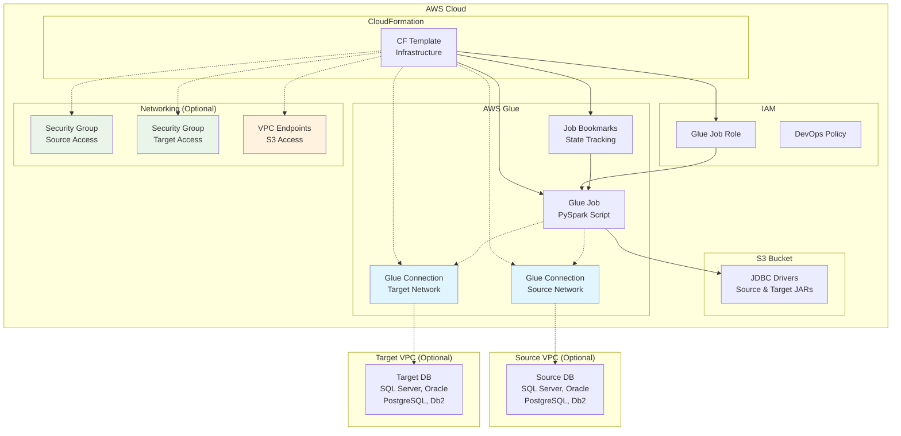
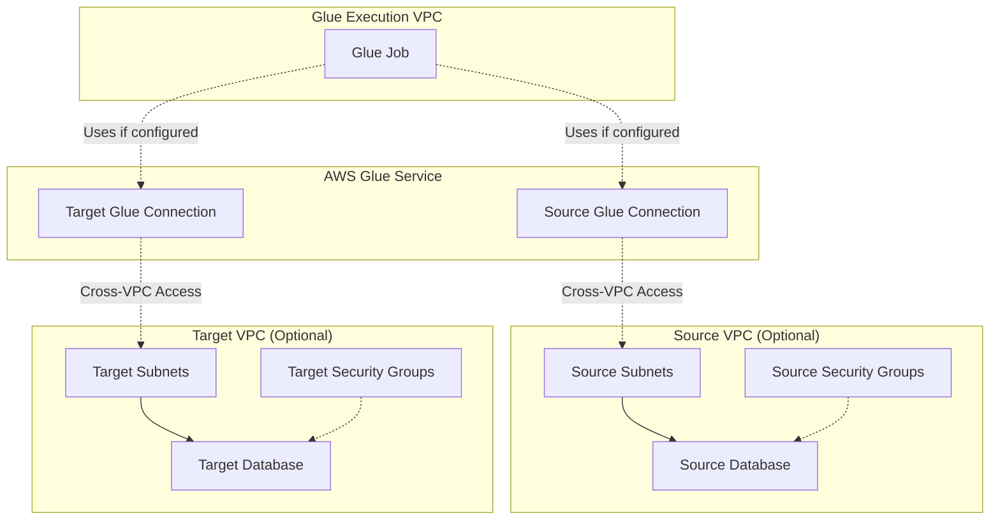

# Design Document

## Overview

This design outlines a data replication system using AWS Glue that supports full-load and incremental data migration across multiple database types. The solution consists of three main components: a CloudFormation template for infrastructure deployment, a PySpark-based Glue job for data processing, and IAM policies for security management. The system leverages AWS Glue's job bookmark feature for efficient incremental loading and uses JDBC connections for database connectivity.

## Architecture

### High-Level Architecture



### Component Architecture

1. **CloudFormation Template**: Orchestrates the deployment of all AWS resources
2. **Glue Job**: PySpark-based data processing engine
3. **IAM Role**: Security context for Glue job execution
4. **S3 Storage**: Houses JDBC drivers and potentially job artifacts
5. **Job Bookmarks**: Tracks processing state for incremental loads
6. **Glue Connections**: Network connectivity for cross-VPC database access (optional)
7. **Security Groups**: Network access control for database connections (optional)
8. **VPC Endpoints**: Private connectivity to AWS services from isolated subnets (optional)

### Network Connectivity Architecture

The system supports three network connectivity scenarios:

1. **Same VPC**: Source and target databases in the same VPC as Glue job
2. **Cross-VPC**: Databases in different VPCs requiring Glue connections
3. **Hybrid**: One database in same VPC, another requiring cross-VPC connection



## Components and Interfaces

### CloudFormation Template

**Purpose**: Infrastructure as Code deployment of the data replication system

**Parameters**:
- `JobName`: Unique identifier for the replication job instance
- `SourceEngineType`: Database engine (Oracle, SQLServer, Db2, PostgreSQL)
- `TargetEngineType`: Database engine (Oracle, SQLServer, Db2, PostgreSQL)
- `SourceDatabase`: Source database name
- `TargetDatabase`: Target database name
- `SourceSchema`: Source schema name
- `TargetSchema`: Target schema name
- `TableNames`: Comma-separated list of tables to replicate
- `SourceDbUser`: Source database username
- `SourceDbPassword`: Source database password (SecureString)
- `TargetDbUser`: Target database username
- `TargetDbPassword`: Target database password (SecureString)
- `SourceJdbcDriverS3Path`: S3 location of source JDBC driver JAR
- `TargetJdbcDriverS3Path`: S3 location of target JDBC driver JAR
- `SourceConnectionString`: JDBC connection string for source
- `TargetConnectionString`: JDBC connection string for target
- `SourceNetworkConfig` (Optional): Network configuration for source database access
  - `SourceVpcId`: VPC ID where source database resides
  - `SourceSubnetIds`: Comma-separated list of subnet IDs for source access
  - `SourceSecurityGroupIds`: Comma-separated list of security group IDs for source
  - `CreateSourceS3VpcEndpoint`: Create S3 VPC endpoint in source VPC (default: NO)
- `TargetNetworkConfig` (Optional): Network configuration for target database access
  - `TargetVpcId`: VPC ID where target database resides
  - `TargetSubnetIds`: Comma-separated list of subnet IDs for target access
  - `TargetSecurityGroupIds`: Comma-separated list of security group IDs for target
  - `CreateTargetS3VpcEndpoint`: Create S3 VPC endpoint in target VPC (default: NO)

**Resources Created**:
- AWS::Glue::Job
- AWS::IAM::Role (for Glue job execution)
- AWS::IAM::Policy (attached to Glue job role)
- AWS::Glue::Connection (conditional, for source network configuration)
- AWS::Glue::Connection (conditional, for target network configuration)
- AWS::EC2::SecurityGroup (conditional, for cross-VPC database access)
- AWS::EC2::VPCEndpoint (conditional, for S3 access from private subnets)

### PySpark Glue Job

**Purpose**: Core data processing logic for replication

**Key Functions**:
- `get_jdbc_connection()`: Establishes database connections using JDBC
- `detect_incremental_columns()`: Identifies columns suitable for incremental loading
- `perform_full_load()`: Executes initial complete data migration
- `perform_incremental_load()`: Executes delta-only data migration
- `transform_data_types()`: Handles cross-database type mapping
- `main()`: Orchestrates the replication process

**Input Parameters** (from CloudFormation):
- Database connection details
- Table specifications
- JDBC driver paths
- Engine types
- Network configuration (optional)

**Network-Aware Functions**:
- `get_glue_connection()`: Retrieves Glue connection for cross-VPC database access
- `validate_network_connectivity()`: Tests database connectivity before processing
- `setup_jdbc_with_connection()`: Configures JDBC with Glue connection if specified

### Glue Connection Components (Optional)

**Purpose**: Enable cross-VPC database connectivity for Glue jobs

**Source Connection Configuration**:
- Connection Type: JDBC
- VPC: Source database VPC ID
- Subnets: Source database subnets
- Security Groups: Source access security groups
- Connection Properties: Source JDBC connection string and credentials

**Target Connection Configuration**:
- Connection Type: JDBC
- VPC: Target database VPC ID
- Subnets: Target database subnets
- Security Groups: Target access security groups
- Connection Properties: Target JDBC connection string and credentials

**Connection Validation**:
- Pre-job connectivity testing
- Network path verification
- Security group rule validation

### Security Group Components (Optional)

**Purpose**: Control network access for cross-VPC database connections

**Source Security Group Rules**:
- Inbound: Allow Glue job access on database port
- Outbound: Allow responses back to Glue execution environment
- Protocol: TCP
- Port Range: Database-specific (1521 for Oracle, 1433 for SQL Server, etc.)

**Target Security Group Rules**:
- Inbound: Allow Glue job access on database port
- Outbound: Allow responses back to Glue execution environment
- Protocol: TCP
- Port Range: Database-specific

### VPC Endpoint Components (Optional)

**Purpose**: Enable private connectivity to S3 for JDBC driver access from isolated subnets

**S3 VPC Endpoint**:
- Service: com.amazonaws.region.s3
- Type: Gateway endpoint
- Creation: Controlled by CloudFormation parameters (CreateSourceS3VpcEndpoint, CreateTargetS3VpcEndpoint)
- Default: Not created (parameter defaults to NO)
- Location: Created in source/target database VPCs when parameter is YES
- Route Table: Associated with database subnets in respective VPCs
- Policy: Allow access to JDBC driver S3 bucket
- Purpose: Enable Glue job to download JDBC drivers when connecting to databases in private subnets without internet access

### IAM Role and Policies

**Glue Job Role Permissions**:
- Glue service execution permissions
- S3 read access for JDBC drivers
- CloudWatch logs write permissions
- Job bookmark read/write permissions
- Glue connection usage permissions (when cross-VPC is configured)
- EC2 network interface creation/deletion (for VPC access)
- VPC endpoint access permissions

**DevOps Policy Permissions**:
- CloudFormation stack operations
- IAM role/policy creation
- Glue job management
- S3 access for driver storage
- Glue connection creation and management
- EC2 security group creation and management
- VPC endpoint creation and management
- EC2 network interface management

## Data Models

### Job Configuration Model

```python
@dataclass
class JobConfig:
    job_name: str
    source_engine: str
    target_engine: str
    source_connection: ConnectionConfig
    target_connection: ConnectionConfig
    tables: List[str]
    jdbc_drivers: JdbcDriverConfig
    network_config: NetworkConfig

@dataclass
class ConnectionConfig:
    engine_type: str
    connection_string: str
    database: str
    schema: str
    username: str
    password: str
    glue_connection_name: Optional[str] = None  # For cross-VPC scenarios

@dataclass
class JdbcDriverConfig:
    source_driver_path: str
    target_driver_path: str

@dataclass
class NetworkConfig:
    source_network: Optional[VpcNetworkConfig] = None
    target_network: Optional[VpcNetworkConfig] = None

@dataclass
class VpcNetworkConfig:
    vpc_id: str
    subnet_ids: List[str]
    security_group_ids: List[str]
    availability_zone: Optional[str] = None
```

### Database Engine Mapping

```python
ENGINE_DRIVERS = {
    'oracle': 'oracle.jdbc.OracleDriver',
    'sqlserver': 'com.microsoft.sqlserver.jdbc.SQLServerDriver',
    'postgresql': 'org.postgresql.Driver',
    'db2': 'com.ibm.db2.jcc.DB2Driver'
}

ENGINE_JDBC_URLS = {
    'oracle': 'jdbc:oracle:thin:@{host}:{port}:{database}',
    'sqlserver': 'jdbc:sqlserver://{host}:{port};databaseName={database}',
    'postgresql': 'jdbc:postgresql://{host}:{port}/{database}',
    'db2': 'jdbc:db2://{host}:{port}/{database}'
}
```

### Incremental Loading Strategy

The system will use a hybrid approach for incremental loading:

1. **Timestamp-based**: For tables with `updated_at` or `modified_date` columns
2. **Primary Key-based**: For tables with auto-incrementing primary keys
3. **Hash-based**: For tables without suitable incremental columns (using row hash comparison)

## Error Handling

### Database Connection Errors

- **Connection Timeout**: Retry with exponential backoff (3 attempts)
- **Authentication Failure**: Log error and fail job with clear message
- **Network Issues**: Retry with different connection parameters if available

### Network Connectivity Errors

- **Glue Connection Failure**: Validate VPC configuration and security group rules
- **Cross-VPC Routing Issues**: Check route tables and network ACLs
- **Security Group Blocking**: Verify inbound/outbound rules for database ports
- **Subnet Accessibility**: Ensure subnets have proper routing to database endpoints
- **VPC Endpoint Issues**: Validate S3 VPC endpoint configuration and policies
- **ENI Creation Failures**: Check subnet capacity and EC2 service limits

### Data Processing Errors

- **Schema Mismatch**: Log detailed error with column differences and fail gracefully
- **Data Type Conversion**: Log warnings for lossy conversions, errors for incompatible types
- **Constraint Violations**: Log specific constraint failures and continue with remaining data

### Infrastructure Errors

- **Missing JDBC Drivers**: Validate S3 paths during job initialization
- **IAM Permission Issues**: Provide clear error messages for missing permissions
- **Job Bookmark Corruption**: Reset bookmarks and perform full load as fallback

### Error Recovery Mechanisms

```python
class ErrorHandler:
    def __init__(self, max_retries=3, backoff_factor=2):
        self.max_retries = max_retries
        self.backoff_factor = backoff_factor
    
    def retry_with_backoff(self, operation, *args, **kwargs):
        # Implementation for exponential backoff retry logic
        pass
    
    def handle_data_error(self, error, context):
        # Log error with context and decide on continuation strategy
        pass
```

## Testing Strategy

### Unit Testing

**PySpark Job Testing**:
- Mock database connections using test containers
- Test data transformation logic with sample datasets
- Validate incremental loading logic with controlled data changes
- Test error handling scenarios with simulated failures

**CloudFormation Testing**:
- Use AWS CloudFormation template validation
- Test parameter validation and resource creation
- Verify IAM role permissions with policy simulation

### Integration Testing

**End-to-End Testing**:
- Deploy CloudFormation stack in test environment
- Execute Glue job with real database connections
- Verify data accuracy and completeness
- Test incremental loading with multiple job runs

**Cross-Database Testing**:
- Test all supported source-target database combinations
- Verify data type mapping accuracy
- Test schema compatibility assumptions

**Network Connectivity Testing**:
- Test same-VPC database connections (baseline scenario)
- Test cross-VPC source database connections with Glue connections
- Test cross-VPC target database connections with Glue connections
- Test hybrid scenarios (one same-VPC, one cross-VPC)
- Validate security group rules and network ACL configurations
- Test VPC endpoint functionality for S3 access from private subnets
- Verify connectivity validation before job execution
- Test network failure scenarios and recovery mechanisms

### Performance Testing

**Scalability Testing**:
- Test with varying data volumes (1K, 100K, 1M+ records)
- Monitor Glue job execution time and resource usage
- Test concurrent job execution scenarios

**Benchmark Testing**:
- Compare full load vs incremental load performance
- Measure impact of different incremental loading strategies
- Test JDBC driver performance across database types

### Test Data Management

```python
class TestDataManager:
    def setup_test_databases(self):
        # Create test databases with sample data
        pass
    
    def create_incremental_changes(self):
        # Simulate data changes for incremental testing
        pass
    
    def validate_replication_accuracy(self, source_table, target_table):
        # Compare source and target data for accuracy
        pass
```

### Automated Testing Pipeline

1. **Pre-deployment**: CloudFormation template validation
2. **Network Setup**: Create test VPCs and database instances for cross-VPC testing
3. **Deployment**: Stack creation in test environment with network configurations
4. **Network Validation**: Test Glue connections and security group rules
5. **Functional**: PySpark job execution with test data across network scenarios
6. **Performance**: Load testing with various data sizes and network configurations
7. **Network Cleanup**: Remove test VPCs and network resources
8. **Cleanup**: Test environment teardown

### Network Configuration Decision Matrix

| Scenario | Source DB Location | Target DB Location | Network Configuration Required |
|----------|-------------------|-------------------|-------------------------------|
| Same VPC | Glue VPC | Glue VPC | None (default) |
| Cross-VPC Source | Different VPC | Glue VPC | Source network config only |
| Cross-VPC Target | Glue VPC | Different VPC | Target network config only |
| Cross-VPC Both | Different VPC A | Different VPC B | Both source and target network configs |
| Hybrid | Different VPC | Same VPC | Source network config only |

**Configuration Guidelines**:
- **Same VPC**: No additional network configuration needed
- **Cross-VPC**: Requires Glue connection with VPC, subnets, and security groups
- **Private Subnets**: Set CreateSourceS3VpcEndpoint/CreateTargetS3VpcEndpoint to YES if databases are in private subnets without internet access
- **Public Subnets**: Leave S3 VPC endpoint parameters as NO (default) - Glue can access S3 via internet gateway
- **Security Groups**: Must allow inbound traffic on database ports from Glue job
- **VPC Endpoints**: Only created when explicitly requested via parameters (default: NO)

The testing strategy ensures reliability across all supported database combinations and validates both functional and non-functional requirements including network connectivity scenarios.