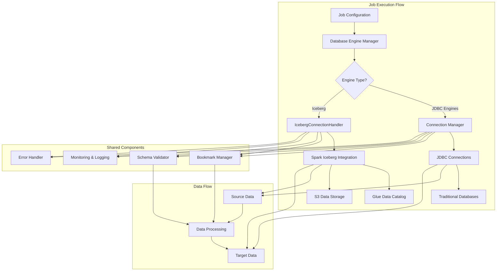

# Design Document: Iceberg Database Engine Support

## Overview

This design document outlines the implementation of Apache Iceberg support as a database engine in the AWS Glue data replication system. Iceberg is a modern, open table format designed for large-scale data storage and analytics in data lakes. Unlike traditional JDBC-based database engines, Iceberg operates through the AWS Glue Data Catalog and uses Spark's native Iceberg integration.

The implementation will extend the existing database engine framework to support Iceberg as both source and target, with automatic table creation, intelligent bookmark management, and seamless integration with the AWS Glue Data Catalog.

## Architecture

### High-Level Architecture



### Component Integration

The Iceberg engine integrates with the existing system through a parallel connection path:

1. **Database Engine Manager**: Extended to recognize Iceberg engine type and route to appropriate handler
   - Traditional engines → Connection Manager → JDBC connections
   - Iceberg engine → IcebergConnectionHandler → Spark/Glue Data Catalog

2. **IcebergConnectionHandler**: New component that replaces JDBC connections for Iceberg
   - Integrates directly with Spark Session and Glue Context
   - Handles table creation, reading, and writing through Glue Data Catalog
   - Uses same interfaces as Connection Manager for seamless integration

3. **Shared Component Integration**: Both connection paths use the same shared components
   - **Bookmark Manager**: Enhanced to support identifier-field-ids for Iceberg tables
   - **Schema Validator**: Extended to handle Iceberg schema creation and validation
   - **Monitoring & Logging**: Same logging infrastructure for both paths
   - **Error Handler**: Extended with Iceberg-specific error handling

4. **Main Job Flow**: The main replication logic remains unchanged
   - Job configuration determines engine type
   - Engine Manager routes to appropriate connection handler
   - Data processing uses same DataFrame operations
   - Bookmark management works transparently for both engine types

## Components and Interfaces

### 1. Iceberg Engine Configuration

**New Configuration Structure:**
```python
ICEBERG_ENGINE_CONFIG = {
    'iceberg': {
        'catalog_name': 'glue_catalog',
        'warehouse_location': 's3://{bucket}/{prefix}/',
        'format_version': '2',
        'requires_jdbc': False,
        'supported_operations': ['read', 'write', 'create', 'append']
    }
}
```

**Required Parameters for Iceberg:**
- `database_name`: Glue Data Catalog database name
- `table_name`: Iceberg table name
- `warehouse_location`: S3 location for table data
- `catalog_id` (optional): AWS account ID for cross-account access to Glue Data Catalog in the same region

### 2. Iceberg Connection Handler

**New Class: `IcebergConnectionHandler`**
```python
class IcebergConnectionHandler:
    """Handles Iceberg table operations through Glue Data Catalog."""
    
    def __init__(self, spark_session: SparkSession, glue_context: GlueContext):
        self.spark = spark_session
        self.glue_context = glue_context
        self.catalog_name = "glue_catalog"
    
    def configure_iceberg_catalog(self, warehouse_location: str) -> None:
        """Configure Spark for Iceberg operations."""
        
    def create_table_if_not_exists(self, database: str, table: str, 
                                 source_schema: StructType, 
                                 bookmark_column: str) -> None:
        """Create Iceberg table with identifier-field-ids."""
        
    def read_table(self, database: str, table: str) -> DataFrame:
        """Read data from Iceberg table."""
        
    def write_table(self, dataframe: DataFrame, database: str, 
                   table: str, mode: str = "append") -> None:
        """Write data to Iceberg table."""
```

### 3. Enhanced Database Engine Manager

**Extended `DatabaseEngineManager`:**
```python
class DatabaseEngineManager:
    # Existing ENGINE_CONFIGS plus:
    ENGINE_CONFIGS = {
        # ... existing engines ...
        'iceberg': {
            'catalog_name': 'glue_catalog',
            'requires_jdbc': False,
            'requires_warehouse_location': True,
            'supported_modes': ['read', 'write', 'create', 'append'],
            'excluded_source_params': ['SourceDbPassword', 'SourceDbUser', 'SourceSchema', 'SourceConnectionString'],
            'excluded_target_params': ['TargetDbPassword', 'TargetDbUser', 'TargetSchema', 'TargetConnectionString'],
            'required_source_params': ['database_name', 'table_name'],
            'required_target_params': ['database_name', 'table_name', 'warehouse_location']
        }
    }
    
    @classmethod
    def is_iceberg_engine(cls, engine_type: str) -> bool:
        """Check if engine is Iceberg type."""
        return engine_type.lower() == 'iceberg'
    
    @classmethod
    def validate_iceberg_config(cls, config: Dict[str, Any]) -> bool:
        """Validate Iceberg-specific configuration."""
        
    @classmethod
    def get_excluded_parameters(cls, engine_type: str, engine_role: str) -> List[str]:
        """Get list of parameters to exclude from validation for specific engine type and role."""
        if cls.is_iceberg_engine(engine_type):
            engine_config = cls.ENGINE_CONFIGS.get('iceberg', {})
            if engine_role == 'source':
                return engine_config.get('excluded_source_params', [])
            elif engine_role == 'target':
                return engine_config.get('excluded_target_params', [])
        return []
    
    @classmethod
    def get_required_parameters(cls, engine_type: str, engine_role: str) -> List[str]:
        """Get list of required parameters for specific engine type and role."""
        if cls.is_iceberg_engine(engine_type):
            engine_config = cls.ENGINE_CONFIGS.get('iceberg', {})
            if engine_role == 'source':
                return engine_config.get('required_source_params', [])
            elif engine_role == 'target':
                return engine_config.get('required_target_params', [])
        return []
```

### 4. Iceberg Schema Manager

**New Class: `IcebergSchemaManager`**
```python
class IcebergSchemaManager:
    """Manages Iceberg table schema creation and validation."""
    
    def create_iceberg_schema_from_jdbc(self, jdbc_metadata: ResultSetMetaData, 
                                      bookmark_column: str) -> Dict[str, Any]:
        """Convert JDBC metadata to Iceberg schema with identifier-field-ids."""
        
    def map_jdbc_to_iceberg_types(self, jdbc_type: str, precision: int, 
                                scale: int) -> str:
        """Map JDBC data types to Iceberg data types."""
        
    def add_identifier_field_ids(self, schema: Dict[str, Any], 
                                bookmark_column: str) -> Dict[str, Any]:
        """Add identifier-field-ids to schema for bookmark management."""
```

### 5. Enhanced Bookmark Manager

**Extended Bookmark Functionality:**
```python
class BookmarkManager:
    # Existing methods plus:
    
    def get_iceberg_bookmark_column(self, database: str, table: str) -> Optional[str]:
        """Get bookmark column from Iceberg table identifier-field-ids."""
        
    def extract_identifier_field_ids(self, table_metadata: Dict[str, Any]) -> Optional[str]:
        """Extract identifier-field-ids from Iceberg table metadata."""
        
    def fallback_to_traditional_bookmark(self, dataframe: DataFrame) -> Optional[str]:
        """Fallback to traditional bookmark detection for Iceberg tables."""
```

## Data Models

### 1. Iceberg Configuration Model

```python
@dataclass
class IcebergConfig:
    """Configuration for Iceberg database engine."""
    database_name: str
    table_name: str
    warehouse_location: str
    catalog_id: Optional[str] = None  # AWS account ID for cross-account catalog access (same region)
    format_version: str = "2"
    enable_update_catalog: bool = True
    update_behavior: str = "UPDATE_IN_DATABASE"
```

### 2. Iceberg Table Metadata Model

```python
@dataclass
class IcebergTableMetadata:
    """Metadata for Iceberg table operations."""
    database: str
    table: str
    location: str
    schema: Dict[str, Any]
    identifier_field_ids: Optional[List[int]] = None
    bookmark_column: Optional[str] = None
    partition_spec: Optional[Dict[str, Any]] = None
```

### 3. Data Type Mapping

**JDBC to Iceberg Type Mapping:**
```python
JDBC_TO_ICEBERG_TYPE_MAPPING = {
    'VARCHAR': 'string',
    'CHAR': 'string',
    'TEXT': 'string',
    'INTEGER': 'int',
    'BIGINT': 'long',
    'SMALLINT': 'int',
    'DECIMAL': 'decimal({precision},{scale})',
    'NUMERIC': 'decimal({precision},{scale})',
    'FLOAT': 'float',
    'DOUBLE': 'double',
    'BOOLEAN': 'boolean',
    'DATE': 'date',
    'TIMESTAMP': 'timestamp',
    'TIME': 'time',
    'BINARY': 'binary',
    'VARBINARY': 'binary'
}
```

## Error Handling

### 1. Iceberg-Specific Exceptions

```python
class IcebergEngineError(Exception):
    """Base exception for Iceberg engine operations."""
    pass

class IcebergTableNotFoundError(IcebergEngineError):
    """Raised when Iceberg table is not found in catalog."""
    pass

class IcebergSchemaCreationError(IcebergEngineError):
    """Raised when Iceberg table schema creation fails."""
    pass

class IcebergCatalogError(IcebergEngineError):
    """Raised when Glue Data Catalog operations fail."""
    pass
```

### 2. Validation Error Handling

- **JDBC URL Validation Bypass**: When Iceberg engine is selected, skip JDBC URL validation
- **Parameter Validation**: Implement Iceberg-specific parameter validation
- **Catalog Access Validation**: Verify access to Glue Data Catalog and S3 warehouse location

### 3. Parameter Validation Logic

**Iceberg-Specific Parameter Exclusions:**

When Iceberg is selected as the database engine (source or target), the following traditional database parameters should be excluded from validation:

**For Source Iceberg Engine:**
- `SourceDbPassword` - Not required (uses IAM roles for authentication)
- `SourceDbUser` - Not required (uses IAM roles for authentication)  
- `SourceSchema` - Not applicable (uses Glue Data Catalog database)
- `SourceConnectionString` - Not applicable (uses Glue Data Catalog and S3)

**For Target Iceberg Engine:**
- `TargetDbPassword` - Not required (uses IAM roles for authentication)
- `TargetDbUser` - Not required (uses IAM roles for authentication)
- `TargetSchema` - Not applicable (uses Glue Data Catalog database)
- `TargetConnectionString` - Not applicable (uses Glue Data Catalog and S3)

**Implementation Approach:**
```python
def validate_engine_parameters(engine_type: str, parameters: Dict[str, Any], 
                             engine_role: str) -> List[str]:
    """Validate parameters based on engine type and role (source/target)."""
    validation_errors = []
    
    if engine_type.lower() == 'iceberg':
        # Skip traditional database parameter validation for Iceberg
        iceberg_required = ['database_name', 'table_name', 'warehouse_location']
        for param in iceberg_required:
            if not parameters.get(param):
                validation_errors.append(f"Missing required Iceberg parameter: {param}")
    else:
        # Apply traditional database parameter validation
        if engine_role == 'source':
            traditional_required = ['SourceDbUser', 'SourceDbPassword', 'SourceConnectionString']
        else:
            traditional_required = ['TargetDbUser', 'TargetDbPassword', 'TargetConnectionString']
            
        for param in traditional_required:
            if not parameters.get(param):
                validation_errors.append(f"Missing required parameter: {param}")
    
    return validation_errors
```

## Testing Strategy

### 1. Unit Tests

- **IcebergConnectionHandler**: Test table creation, reading, and writing operations
- **IcebergSchemaManager**: Test JDBC to Iceberg type mapping and schema creation
- **Enhanced BookmarkManager**: Test identifier-field-ids extraction and fallback mechanisms
- **Parameter Validation**: Test Iceberg-specific configuration validation

### 2. Integration Tests

- **End-to-End Replication**: Test complete replication flow with Iceberg as source and target
- **Schema Evolution**: Test handling of schema changes in Iceberg tables
- **Bookmark Management**: Test bookmark persistence and retrieval with identifier-field-ids
- **Cross-Engine Replication**: Test replication between traditional databases and Iceberg

### 3. Performance Tests

- **Large Dataset Handling**: Test replication of large datasets to/from Iceberg tables
- **Concurrent Operations**: Test multiple concurrent replication jobs with Iceberg
- **Catalog Performance**: Test Glue Data Catalog operations under load

## Implementation Phases

### Phase 1: Core Infrastructure
- Extend DatabaseEngineManager for Iceberg support
- Implement IcebergConnectionHandler
- Create IcebergSchemaManager
- Update parameter validation logic

### Phase 2: Table Operations
- Implement automatic table creation with identifier-field-ids
- Add JDBC to Iceberg type mapping
- Implement read/write operations for Iceberg tables
- Update bookmark management for Iceberg

### Phase 3: Integration & Testing
- Integrate with existing connection management
- Implement comprehensive error handling
- Create unit and integration tests
- Update documentation

### Phase 4: Documentation & Cleanup
- Update all project documentation
- Create usage examples and best practices
- Remove temporary implementation files
- Final validation and testing

## Security Considerations

### 1. IAM Permissions

Required IAM permissions for Iceberg operations:
```json
{
    "Version": "2012-10-17",
    "Statement": [
        {
            "Effect": "Allow",
            "Action": [
                "glue:GetDatabase",
                "glue:GetTable",
                "glue:CreateTable",
                "glue:UpdateTable",
                "glue:GetPartitions"
            ],
            "Resource": "*"
        },
        {
            "Effect": "Allow",
            "Action": [
                "s3:GetObject",
                "s3:PutObject",
                "s3:DeleteObject",
                "s3:ListBucket"
            ],
            "Resource": [
                "arn:aws:s3:::warehouse-bucket/*",
                "arn:aws:s3:::warehouse-bucket"
            ]
        }
    ]
}
```

### 2. Data Encryption

- Support for S3 server-side encryption (SSE-S3, SSE-KMS)
- Integration with existing encryption configurations
- Proper handling of encrypted Iceberg table data

## Performance Optimizations

### 1. Spark Configuration

Optimal Spark settings for Iceberg operations:
```python
ICEBERG_SPARK_CONFIG = {
    "spark.sql.extensions": "org.apache.iceberg.spark.extensions.IcebergSparkSessionExtensions",
    "spark.sql.catalog.glue_catalog": "org.apache.iceberg.spark.SparkCatalog",
    "spark.sql.catalog.glue_catalog.catalog-impl": "org.apache.iceberg.aws.glue.GlueCatalog",
    "spark.sql.catalog.glue_catalog.io-impl": "org.apache.iceberg.aws.s3.S3FileIO",
    "spark.serializer": "org.apache.spark.serializer.KryoSerializer"
}
```

### 2. Table Optimization

- Use Iceberg format version 2 for better performance
- Implement proper partitioning strategies
- Enable table compaction for optimal read performance
- Use appropriate file sizes for S3 operations