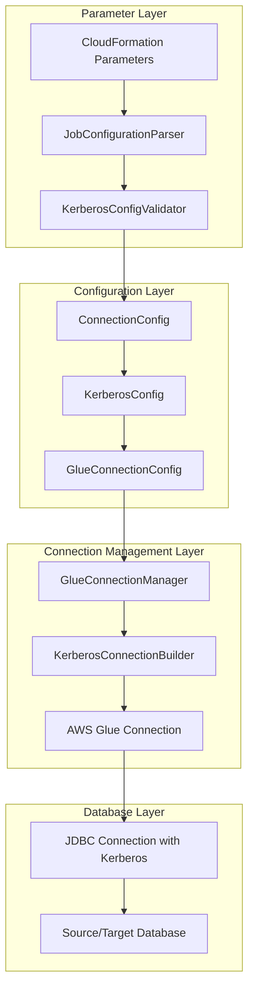
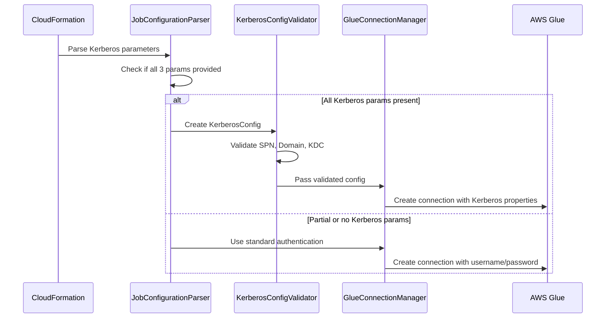

# Design Document

## Overview

This design document outlines the implementation of Kerberos authentication support for the AWS Glue Data Replication solution. The enhancement will add enterprise-grade authentication capabilities by introducing six new CloudFormation parameters and extending the existing connection management system to automatically detect and configure Kerberos authentication when all required parameters are provided.

The solution maintains backward compatibility with existing parameter files while providing seamless integration with enterprise Kerberos environments for SQL Server, Oracle, DB2, and PostgreSQL databases.

## Architecture

### High-Level Architecture

The Kerberos authentication support integrates into the existing modular architecture without disrupting current functionality:



### Integration Points

1. **Parameter Parsing**: New Kerberos parameters are parsed alongside existing database parameters
2. **Configuration Validation**: Kerberos configuration is validated during job configuration creation
3. **Connection Creation**: Glue Connection creation is enhanced to include Kerberos properties
4. **Authentication Flow**: JDBC connections use Kerberos authentication when configured

## Components and Interfaces

### 1. New CloudFormation Parameters

Six new optional parameters will be added to the CloudFormation template:

```yaml
# Source Kerberos Parameters
SourceKerberosSPN:
  Type: String
  Description: 'Service Principal Name for source database Kerberos authentication'
  Default: ''
  MaxLength: 256

SourceKerberosDomain:
  Type: String  
  Description: 'Kerberos domain/realm for source database authentication'
  Default: ''
  MaxLength: 128

SourceKerberosKDC:
  Type: String
  Description: 'Key Distribution Center (KDC) for source database Kerberos authentication'
  Default: ''
  MaxLength: 256

# Target Kerberos Parameters  
TargetKerberosSPN:
  Type: String
  Description: 'Service Principal Name for target database Kerberos authentication'
  Default: ''
  MaxLength: 256

TargetKerberosDomain:
  Type: String
  Description: 'Kerberos domain/realm for target database authentication'
  Default: ''
  MaxLength: 128

TargetKerberosKDC:
  Type: String
  Description: 'Key Distribution Center (KDC) for target database Kerberos authentication'
  Default: ''
  MaxLength: 256
```

### 2. KerberosConfig Data Class

A new configuration class to encapsulate Kerberos authentication parameters:

```python
@dataclass
class KerberosConfig:
    """Configuration for Kerberos authentication."""
    spn: str  # Service Principal Name
    domain: str  # Kerberos domain/realm
    kdc: str  # Key Distribution Center
    
    def is_complete(self) -> bool:
        """Check if all required Kerberos parameters are provided."""
        return bool(self.spn and self.domain and self.kdc)
    
    def validate(self) -> None:
        """Validate Kerberos configuration parameters."""
        # Validation logic for SPN, domain, and KDC formats
        pass
    
    def to_glue_properties(self) -> Dict[str, str]:
        """Convert to Glue Connection properties format."""
        return {
            'KERBEROS_SPN': self.spn,
            'KERBEROS_DOMAIN': self.domain,
            'KERBEROS_KDC': self.kdc
        }
```

### 3. Enhanced ConnectionConfig

The existing `ConnectionConfig` class will be extended to include Kerberos configuration:

```python
@dataclass
class ConnectionConfig:
    # Existing fields...
    kerberos_config: Optional[KerberosConfig] = None
    
    def uses_kerberos_authentication(self) -> bool:
        """Check if this connection uses Kerberos authentication."""
        return self.kerberos_config and self.kerberos_config.is_complete()
    
    def get_authentication_method(self) -> str:
        """Get the authentication method for this connection."""
        if self.uses_kerberos_authentication():
            return "kerberos"
        return "username_password"
```

### 4. KerberosConnectionBuilder

A new component to handle Kerberos-specific Glue Connection creation:

```python
class KerberosConnectionBuilder:
    """Builds Glue Connections with Kerberos authentication."""
    
    def build_kerberos_connection_properties(self, 
                                           connection_config: ConnectionConfig) -> Dict[str, str]:
        """Build Glue Connection properties with Kerberos configuration."""
        properties = {
            'JDBC_CONNECTION_URL': connection_config.connection_string,
            'JDBC_ENFORCE_SSL': 'false'  # Kerberos provides encryption
        }
        
        if connection_config.kerberos_config:
            properties.update(connection_config.kerberos_config.to_glue_properties())
            properties['AUTHENTICATION_TYPE'] = 'KERBEROS'
        
        return properties
    
    def validate_engine_kerberos_support(self, engine_type: str) -> None:
        """Validate that the engine supports Kerberos authentication."""
        supported_engines = ['oracle', 'sqlserver', 'postgresql', 'db2']
        if engine_type.lower() not in supported_engines:
            raise ValueError(f"Kerberos authentication not supported for {engine_type}")
```

### 5. Enhanced JobConfigurationParser

The parser will be extended to handle Kerberos parameters:

```python
class JobConfigurationParser:
    # New Kerberos parameter constants
    KERBEROS_PARAMS = [
        'SourceKerberosSPN', 'SourceKerberosDomain', 'SourceKerberosKDC',
        'TargetKerberosSPN', 'TargetKerberosDomain', 'TargetKerberosKDC'
    ]
    
    @classmethod
    def parse_kerberos_config(cls, args: Dict[str, str], 
                            connection_type: str) -> Optional[KerberosConfig]:
        """Parse Kerberos configuration for source or target."""
        prefix = connection_type.upper()
        
        spn = args.get(f'{prefix}KerberosSPN', '').strip()
        domain = args.get(f'{prefix}KerberosDomain', '').strip()
        kdc = args.get(f'{prefix}KerberosKDC', '').strip()
        
        # Only create config if all three parameters are provided
        if spn and domain and kdc:
            return KerberosConfig(spn=spn, domain=domain, kdc=kdc)
        
        # Log warning if partial configuration is detected
        if spn or domain or kdc:
            logger.warning(f"Partial Kerberos configuration for {connection_type} - "
                         "all three parameters (SPN, Domain, KDC) are required")
        
        return None
```

### 6. Enhanced GlueConnectionManager

The connection manager will be updated to handle Kerberos authentication:

```python
class GlueConnectionManager:
    def __init__(self, glue_context: GlueContext):
        # Existing initialization...
        self.kerberos_builder = KerberosConnectionBuilder()
    
    def create_glue_connection_with_kerberos(self, 
                                           connection_config: ConnectionConfig,
                                           connection_name: str) -> str:
        """Create Glue Connection with Kerberos authentication support."""
        
        # Validate Kerberos configuration if present
        if connection_config.uses_kerberos_authentication():
            self.kerberos_builder.validate_engine_kerberos_support(
                connection_config.engine_type
            )
            connection_config.kerberos_config.validate()
        
        # Build connection properties
        if connection_config.uses_kerberos_authentication():
            connection_properties = self.kerberos_builder.build_kerberos_connection_properties(
                connection_config
            )
        else:
            # Use existing username/password method
            connection_properties = self._build_standard_connection_properties(
                connection_config
            )
        
        # Create Glue Connection with appropriate properties
        return self._create_glue_connection_internal(connection_name, connection_properties)
```

## Data Models

### Kerberos Configuration Flow



### Authentication Decision Matrix

| Source Kerberos | Target Kerberos | Authentication Method |
|----------------|----------------|----------------------|
| Complete | Complete | Both use Kerberos |
| Complete | Incomplete/None | Source: Kerberos, Target: Standard |
| Incomplete/None | Complete | Source: Standard, Target: Kerberos |
| Incomplete/None | Incomplete/None | Both use Standard |

## Error Handling

### 1. Kerberos-Specific Exceptions

```python
class KerberosAuthenticationError(Exception):
    """Base exception for Kerberos authentication errors."""
    pass

class KerberosConfigurationError(KerberosAuthenticationError):
    """Exception for Kerberos configuration validation errors."""
    pass

class KerberosConnectionError(KerberosAuthenticationError):
    """Exception for Kerberos connection establishment errors."""
    pass

class KerberosEngineCompatibilityError(KerberosAuthenticationError):
    """Exception for unsupported engine types with Kerberos."""
    pass
```

### 2. Error Handling Strategy

1. **Configuration Validation**: Validate Kerberos parameters during job configuration parsing
2. **Engine Compatibility**: Check engine support before attempting Kerberos connection creation
3. **Graceful Fallback**: Fall back to standard authentication if Kerberos configuration is incomplete
4. **Detailed Logging**: Provide comprehensive error messages for troubleshooting
5. **Security Considerations**: Never log sensitive Kerberos credentials

### 3. Validation Rules

- **SPN Format**: Must follow standard SPN format (service/hostname@REALM)
- **Domain Format**: Must be a valid Kerberos realm name
- **KDC Format**: Must be a valid hostname or IP address with optional port
- **Engine Support**: Only oracle, sqlserver, postgresql, db2 engines support Kerberos
- **Complete Configuration**: All three parameters must be provided together

## Testing Strategy

### 1. Unit Tests

- **KerberosConfig validation**: Test parameter validation and format checking
- **Parser integration**: Test Kerberos parameter parsing in JobConfigurationParser
- **Connection building**: Test Glue Connection property generation with Kerberos
- **Error handling**: Test all Kerberos-specific exception scenarios

### 2. Integration Tests

- **Mixed authentication**: Test scenarios with different auth methods for source/target
- **Fallback behavior**: Test graceful fallback when Kerberos config is incomplete
- **Engine compatibility**: Test Kerberos support validation for different engines
- **Parameter combinations**: Test various combinations of Kerberos and standard parameters

### 3. End-to-End Tests

- **Kerberos connection creation**: Test actual Glue Connection creation with Kerberos properties
- **Authentication flow**: Test complete authentication flow with mock Kerberos environment
- **Error scenarios**: Test real-world error conditions and recovery

### 4. Security Tests

- **Credential handling**: Ensure Kerberos credentials are never logged in plain text
- **Parameter validation**: Test security-focused validation of Kerberos parameters
- **Connection security**: Verify secure handling of Kerberos authentication tokens

## Implementation Phases

### Phase 1: Core Infrastructure
1. Add new CloudFormation parameters
2. Create KerberosConfig data class
3. Extend ConnectionConfig with Kerberos support
4. Update JobConfigurationParser for Kerberos parameters

### Phase 2: Connection Management
1. Create KerberosConnectionBuilder component
2. Enhance GlueConnectionManager with Kerberos support
3. Implement Kerberos-specific error handling
4. Add comprehensive validation logic

### Phase 3: Testing and Documentation
1. Implement comprehensive unit tests
2. Create integration test scenarios
3. Update documentation with Kerberos configuration guides
4. Create example parameter files with Kerberos authentication

### Phase 4: Monitoring and Observability
1. Add Kerberos-specific logging and metrics
2. Enhance error reporting for Kerberos issues
3. Update CloudWatch dashboards with Kerberos authentication metrics
4. Create troubleshooting guides for common Kerberos issues