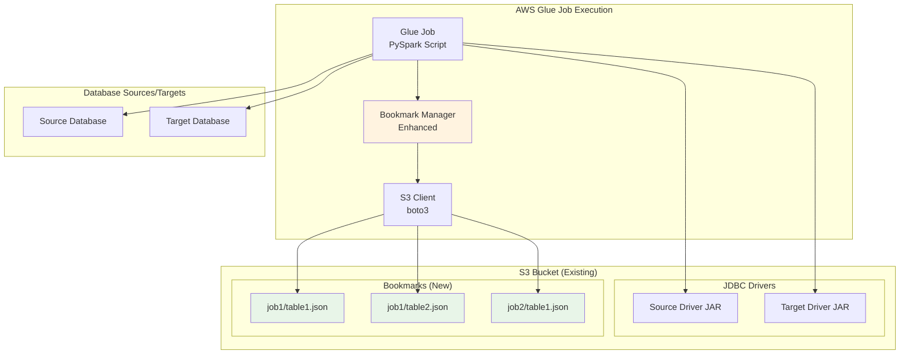
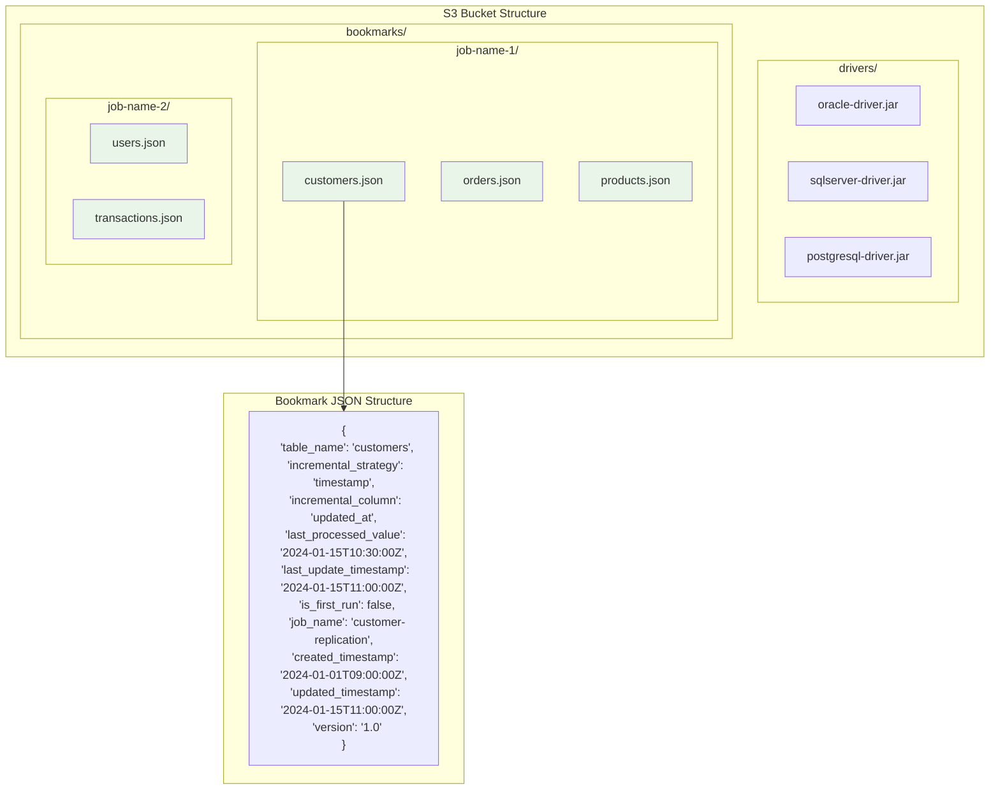
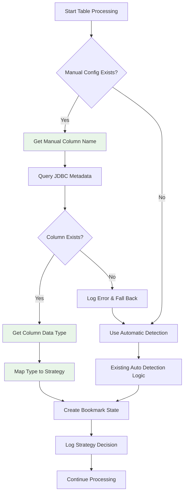
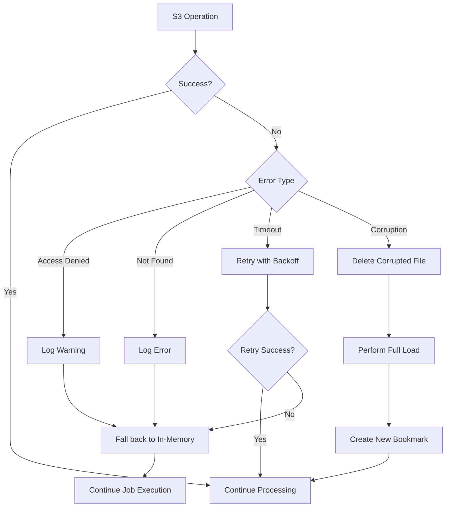

# Design Document

## Overview

This design implements persistent bookmark storage on S3 for the AWS Glue data replication system. The enhancement replaces the current in-memory bookmark system with a robust S3-based solution that maintains state across job executions. The design leverages the existing S3 bucket used for JDBC drivers, ensuring no additional infrastructure or permissions are required. The implementation maintains full backward compatibility while providing true incremental loading capabilities.

## Architecture

### High-Level Architecture



### Bookmark Storage Architecture



## Components and Interfaces

### Enhanced JobBookmarkManager Class

**Purpose**: Manages persistent bookmark state using S3 storage with manual configuration support

**Key Enhancements**:
- S3 bucket detection from JDBC driver paths
- Asynchronous bookmark read/write operations
- Error handling and fallback to in-memory bookmarks
- JSON serialization/deserialization with validation
- Manual bookmark configuration parsing and validation
- JDBC metadata integration for column type detection

**New Methods**:
```python
class JobBookmarkManager:
    def __init__(self, glue_context: GlueContext, job_name: str, 
                 source_jdbc_path: str, target_jdbc_path: str, 
                 manual_bookmark_config: Optional[str] = None, job: Job = None):
        # Enhanced constructor with manual config parameter
        
    def _extract_s3_bucket(self, s3_path: str) -> str:
        # Extract bucket name from S3 path
        
    def _get_bookmark_s3_key(self, table_name: str) -> str:
        # Generate S3 key for bookmark file
        
    async def _read_bookmark_from_s3(self, table_name: str) -> Optional[Dict[str, Any]]:
        # Asynchronously read bookmark from S3
        
    async def _write_bookmark_to_s3(self, table_name: str, bookmark_data: Dict[str, Any]) -> bool:
        # Asynchronously write bookmark to S3
        
    def _validate_bookmark_data(self, data: Dict[str, Any]) -> bool:
        # Validate bookmark JSON structure
        
    def _handle_s3_error(self, operation: str, table_name: str, error: Exception) -> None:
        # Handle S3 operation errors with appropriate fallback
        
    def _parse_manual_bookmark_config(self, config_json: str) -> Dict[str, ManualBookmarkConfig]:
        # Parse and validate manual bookmark configuration JSON
        
    def _get_column_data_type(self, table_name: str, column_name: str, connection) -> Optional[str]:
        # Query JDBC metadata to get column data type
        
    def _determine_strategy_from_data_type(self, data_type: str) -> str:
        # Map JDBC data type to bookmark strategy
        
    def _get_bookmark_strategy_for_table(self, table_name: str, connection) -> Tuple[str, Optional[str]]:
        # Get bookmark strategy using manual config or automatic detection
```

### S3BookmarkStorage Class

**Purpose**: Dedicated class for S3 bookmark operations

**Interface**:
```python
@dataclass
class S3BookmarkConfig:
    bucket_name: str
    bookmark_prefix: str
    job_name: str
    retry_attempts: int = 3
    timeout_seconds: int = 30

class S3BookmarkStorage:
    def __init__(self, config: S3BookmarkConfig):
        self.config = config
        self.s3_client = boto3.client('s3', config=Config(
            retries={'max_attempts': config.retry_attempts},
            read_timeout=config.timeout_seconds
        ))
    
    async def read_bookmark(self, table_name: str) -> Optional[Dict[str, Any]]:
        # Read bookmark from S3 with error handling
        
    async def write_bookmark(self, table_name: str, bookmark_data: Dict[str, Any]) -> bool:
        # Write bookmark to S3 with error handling
        
    async def delete_bookmark(self, table_name: str) -> bool:
        # Delete corrupted bookmark from S3
        
    def list_bookmarks(self) -> List[str]:
        # List all bookmark files for the job
```

### Enhanced JobBookmarkState Class

**Purpose**: Extended bookmark state with S3 metadata and manual configuration tracking

**Enhanced Structure**:
```python
@dataclass
class JobBookmarkState:
    # Existing fields
    table_name: str
    incremental_strategy: str
    incremental_column: Optional[str] = None
    last_processed_value: Optional[Any] = None
    last_update_timestamp: Optional[datetime] = None
    is_first_run: bool = True
    
    # New S3-specific fields
    job_name: str = ""
    created_timestamp: Optional[datetime] = None
    updated_timestamp: Optional[datetime] = None
    version: str = "1.0"
    s3_key: Optional[str] = None
    
    # Manual configuration tracking
    is_manually_configured: bool = False
    manual_column_data_type: Optional[str] = None
    
    def to_s3_dict(self) -> Dict[str, Any]:
        # Convert to S3-compatible dictionary with ISO timestamps
        
    @classmethod
    def from_s3_dict(cls, data: Dict[str, Any]) -> 'JobBookmarkState':
        # Create from S3 dictionary with validation
        
    def validate_s3_data(self) -> bool:
        # Validate S3 bookmark data integrity

### ManualBookmarkConfig Class

**Purpose**: Configuration structure for manual bookmark settings

**Structure**:
```python
@dataclass
class ManualBookmarkConfig:
    table_name: str
    column_name: str
    
    def __post_init__(self):
        # Validate table and column names
        if not self.table_name or not self.column_name:
            raise ValueError("Table name and column name are required")
    
    @classmethod
    def from_dict(cls, data: Dict[str, str]) -> 'ManualBookmarkConfig':
        # Create from dictionary with validation
        return cls(
            table_name=data.get('table_name', '').strip(),
            column_name=data.get('column_name', '').strip()
        )

### BookmarkStrategyResolver Class

**Purpose**: Resolves bookmark strategies using manual config or automatic detection

**Interface**:
```python
class BookmarkStrategyResolver:
    def __init__(self, manual_configs: Dict[str, ManualBookmarkConfig]):
        self.manual_configs = manual_configs
        self.jdbc_metadata_cache = {}
    
    def resolve_strategy(self, table_name: str, connection) -> Tuple[str, Optional[str], bool]:
        # Returns: (strategy, column, is_manual)
        
    def _get_manual_strategy(self, table_name: str, connection) -> Optional[Tuple[str, str]]:
        # Get strategy from manual configuration
        
    def _get_automatic_strategy(self, table_name: str, connection) -> Tuple[str, Optional[str]]:
        # Get strategy from automatic detection (existing logic)
        
    def _map_jdbc_type_to_strategy(self, jdbc_type: str) -> str:
        # Map JDBC data type to bookmark strategy
```

## Data Models

### Bookmark File Structure

**S3 Path Pattern**: `s3://{bucket}/bookmarks/{job_name}/{table_name}.json`

**Enhanced JSON Schema**:
```json
{
  "type": "object",
  "required": ["table_name", "incremental_strategy", "job_name", "version"],
  "properties": {
    "table_name": {"type": "string"},
    "incremental_strategy": {"type": "string", "enum": ["timestamp", "primary_key", "hash"]},
    "incremental_column": {"type": ["string", "null"]},
    "last_processed_value": {"type": ["string", "number", "null"]},
    "last_update_timestamp": {"type": ["string", "null"], "format": "date-time"},
    "is_first_run": {"type": "boolean"},
    "job_name": {"type": "string"},
    "created_timestamp": {"type": "string", "format": "date-time"},
    "updated_timestamp": {"type": "string", "format": "date-time"},
    "version": {"type": "string"},
    "is_manually_configured": {"type": "boolean"},
    "manual_column_data_type": {"type": ["string", "null"]}
  }
}
```

### Manual Bookmark Configuration Structure

**Job Parameter Format**: `manual_bookmark_config` (JSON string)

**Configuration Schema**:
```json
{
  "type": "object",
  "patternProperties": {
    "^[a-zA-Z_][a-zA-Z0-9_]*$": {
      "type": "object",
      "required": ["table_name", "column_name"],
      "properties": {
        "table_name": {"type": "string"},
        "column_name": {"type": "string"}
      }
    }
  }
}
```

**Example Configuration**:
```json
{
  "customers": {
    "table_name": "customers",
    "column_name": "last_modified_date"
  },
  "orders": {
    "table_name": "orders", 
    "column_name": "order_timestamp"
  },
  "products": {
    "table_name": "products",
    "column_name": "product_id"
  }
}
```

### JDBC Data Type Mapping

**Data Type to Strategy Mapping**:
```python
JDBC_TYPE_TO_STRATEGY = {
    # Timestamp types -> timestamp strategy
    'TIMESTAMP': 'timestamp',
    'TIMESTAMP_WITH_TIMEZONE': 'timestamp',
    'DATE': 'timestamp',
    'DATETIME': 'timestamp',
    'TIME': 'timestamp',
    
    # Integer types -> primary_key strategy  
    'INTEGER': 'primary_key',
    'BIGINT': 'primary_key',
    'SMALLINT': 'primary_key',
    'TINYINT': 'primary_key',
    'SERIAL': 'primary_key',
    'BIGSERIAL': 'primary_key',
    
    # String and other types -> hash strategy
    'VARCHAR': 'hash',
    'CHAR': 'hash',
    'TEXT': 'hash',
    'CLOB': 'hash',
    'DECIMAL': 'hash',
    'NUMERIC': 'hash',
    'FLOAT': 'hash',
    'DOUBLE': 'hash',
    'BOOLEAN': 'hash',
    'BINARY': 'hash',
    'VARBINARY': 'hash',
    'BLOB': 'hash'
}
```

### S3 Bucket Detection Logic

**Algorithm**:
1. Extract bucket name from source JDBC driver S3 path
2. If source and target use different buckets, prefer source bucket
3. Validate bucket accessibility before proceeding
4. Fall back to in-memory bookmarks if S3 access fails

**Implementation**:
```python
def extract_s3_bucket(s3_path: str) -> str:
    """
    Extract bucket name from S3 path.
    Example: s3://my-bucket/drivers/oracle.jar -> my-bucket
    """
    if not s3_path.startswith('s3://'):
        raise ValueError(f"Invalid S3 path: {s3_path}")
    
    # Remove s3:// prefix and split by /
    path_parts = s3_path[5:].split('/')
    if len(path_parts) < 1:
        raise ValueError(f"Invalid S3 path format: {s3_path}")
    
    return path_parts[0]
```

### Manual Bookmark Configuration Workflow

**Configuration Resolution Flow**:


**JDBC Metadata Query Process**:
```python
def get_column_metadata(connection, table_name: str, column_name: str) -> Optional[Dict[str, Any]]:
    """
    Query JDBC metadata to get column information.
    Returns column data type and other metadata.
    """
    try:
        # Get database metadata
        metadata = connection.getMetaData()
        
        # Query column information
        result_set = metadata.getColumns(None, None, table_name, column_name)
        
        if result_set.next():
            return {
                'column_name': result_set.getString('COLUMN_NAME'),
                'data_type': result_set.getString('TYPE_NAME'),
                'jdbc_type': result_set.getInt('DATA_TYPE'),
                'column_size': result_set.getInt('COLUMN_SIZE'),
                'nullable': result_set.getInt('NULLABLE')
            }
        
        return None
        
    except Exception as e:
        logger.error(f"Failed to query metadata for {table_name}.{column_name}: {e}")
        return None
```

**Strategy Resolution Algorithm**:
```python
def resolve_bookmark_strategy(table_name: str, manual_configs: Dict, connection) -> Tuple[str, str, bool]:
    """
    Resolve bookmark strategy for a table.
    Returns: (strategy, column, is_manual)
    """
    # Check for manual configuration
    if table_name in manual_configs:
        manual_config = manual_configs[table_name]
        column_name = manual_config.column_name
        
        # Query JDBC metadata
        metadata = get_column_metadata(connection, table_name, column_name)
        
        if metadata:
            data_type = metadata['data_type'].upper()
            strategy = JDBC_TYPE_TO_STRATEGY.get(data_type, 'hash')
            
            logger.info(f"Manual bookmark config for {table_name}: column={column_name}, "
                       f"type={data_type}, strategy={strategy}")
            
            return strategy, column_name, True
        else:
            logger.error(f"Manual config column {column_name} not found in {table_name}, "
                        f"falling back to automatic detection")
    
    # Fall back to automatic detection
    strategy, column = detect_incremental_strategy_automatically(table_name, connection)
    logger.info(f"Automatic bookmark detection for {table_name}: column={column}, strategy={strategy}")
    
    return strategy, column, False
```

## Error Handling

### S3 Operation Error Handling

**Error Categories and Responses**:

1. **Access Denied (403)**:
   - Log warning about insufficient permissions
   - Fall back to in-memory bookmarks
   - Continue job execution

2. **Bucket Not Found (404)**:
   - Log error about invalid bucket configuration
   - Fall back to in-memory bookmarks
   - Continue job execution

3. **Network Timeouts**:
   - Retry with exponential backoff (3 attempts)
   - Log retry attempts and final outcome
   - Fall back to in-memory bookmarks on final failure

4. **Corrupted Bookmark Data**:
   - Log warning about data corruption
   - Delete corrupted file from S3
   - Perform full load and create new bookmark

**Error Handling Flow**:


### Resilience Patterns

**Circuit Breaker Pattern**:
- Track S3 operation failure rate
- Temporarily disable S3 operations if failure rate exceeds threshold
- Automatically re-enable after cooldown period

**Graceful Degradation**:
- Always prioritize job execution over bookmark persistence
- Log all fallback scenarios for monitoring
- Provide clear error messages for troubleshooting

## Testing Strategy

### Unit Testing

**S3BookmarkStorage Testing**:
- Mock S3 client for isolated testing
- Test all error scenarios (403, 404, timeouts)
- Validate JSON serialization/deserialization
- Test retry logic and exponential backoff

**JobBookmarkManager Testing**:
- Test S3 bucket extraction from various path formats
- Test bookmark state transitions (first run → incremental)
- Test fallback to in-memory bookmarks
- Test concurrent bookmark operations

### Integration Testing

**S3 Integration Testing**:
- Test with real S3 bucket and IAM permissions
- Test bookmark persistence across job executions
- Test with different S3 bucket configurations
- Test network failure scenarios

**End-to-End Testing**:
- Deploy enhanced system in test environment
- Execute multiple job runs with incremental data
- Verify bookmark state persistence and accuracy
- Test recovery from corrupted bookmark files

### Performance Testing

**S3 Operation Performance**:
- Measure bookmark read/write latency
- Test with multiple concurrent tables
- Validate asynchronous operation benefits
- Monitor S3 request costs and optimization opportunities

**Scalability Testing**:
- Test with large numbers of tables (100+)
- Test with high-frequency job executions
- Monitor S3 rate limiting and throttling
- Test bookmark file size growth over time

### Test Scenarios

**Scenario 1: First-Time Deployment**
- Deploy enhanced system to existing job
- Verify full load execution and bookmark creation
- Confirm S3 bookmark files are created correctly

**Scenario 2: Incremental Loading**
- Execute job multiple times with data changes
- Verify incremental loading using S3 bookmarks
- Confirm bookmark state updates correctly

**Scenario 3: Error Recovery**
- Simulate S3 access failures
- Verify fallback to in-memory bookmarks
- Confirm job continues execution successfully

**Scenario 4: Bookmark Corruption**
- Manually corrupt bookmark JSON files
- Verify detection and recovery mechanisms
- Confirm full load execution and bookmark recreation

## Implementation Phases

### Phase 1: Core S3 Integration
- Implement S3BookmarkStorage class
- Add S3 bucket detection logic
- Implement basic read/write operations
- Add comprehensive error handling

### Phase 2: Manual Configuration Framework
- Implement ManualBookmarkConfig and BookmarkStrategyResolver classes
- Add manual configuration parsing and validation
- Implement JDBC metadata querying for column data types
- Add data type to strategy mapping logic

### Phase 3: Enhanced BookmarkManager Integration
- Integrate S3BookmarkStorage and manual configuration into existing JobBookmarkManager
- Implement asynchronous operations with manual config support
- Add fallback mechanisms for manual config failures
- Enhance logging and monitoring for manual vs automatic detection

### Phase 4: Testing and Validation
- Comprehensive unit and integration testing for manual configuration
- Test JDBC metadata querying across different database engines
- Performance testing and optimization
- Documentation updates and backward compatibility validation

### Phase 5: Deployment and Monitoring
- Deploy to test environments with manual configuration examples
- Monitor S3 operation metrics and manual config usage
- Validate cost implications and performance impact
- Production deployment preparation

## Monitoring and Observability

### CloudWatch Metrics

**Custom Metrics**:
- `BookmarkS3ReadSuccess`: Successful S3 bookmark reads
- `BookmarkS3ReadFailure`: Failed S3 bookmark reads
- `BookmarkS3WriteSuccess`: Successful S3 bookmark writes
- `BookmarkS3WriteFailure`: Failed S3 bookmark writes
- `BookmarkFallbackToMemory`: Fallback to in-memory bookmarks

**Metric Dimensions**:
- JobName
- TableName
- ErrorType (for failure metrics)

### Structured Logging

**Log Events**:
- Bookmark S3 operations (read/write/delete)
- S3 bucket detection and validation
- Error conditions and fallback scenarios
- Performance metrics (operation latency)

**Log Format**:
```json
{
  "timestamp": "2024-01-15T11:00:00Z",
  "level": "INFO",
  "job_name": "customer-replication",
  "table_name": "customers",
  "operation": "bookmark_read",
  "s3_bucket": "my-glue-assets",
  "s3_key": "bookmarks/customer-replication/customers.json",
  "duration_ms": 150,
  "status": "success",
  "message": "Successfully read bookmark from S3"
}
```

### Alerting

**Alert Conditions**:
- High S3 operation failure rate (>10% over 5 minutes)
- Repeated fallback to in-memory bookmarks
- Bookmark corruption detection
- S3 access permission issues

## Security Considerations

### IAM Permissions

**Required S3 Permissions** (already granted via existing JDBC driver access):
- `s3:GetObject` on bookmark files
- `s3:PutObject` on bookmark files
- `s3:DeleteObject` on corrupted bookmark files
- `s3:ListBucket` for bookmark prefix

**Security Best Practices**:
- Use existing IAM role permissions (no additional grants needed)
- Encrypt bookmark files using S3 default encryption
- Implement least-privilege access patterns
- Log all S3 operations for audit trails

### Data Protection

**Bookmark Data Security**:
- No sensitive data stored in bookmark files
- Use S3 server-side encryption (SSE-S3)
- Implement data validation to prevent injection attacks
- Regular cleanup of old bookmark files

The design ensures robust, scalable, and secure persistent bookmark storage while maintaining full backward compatibility with existing deployments.