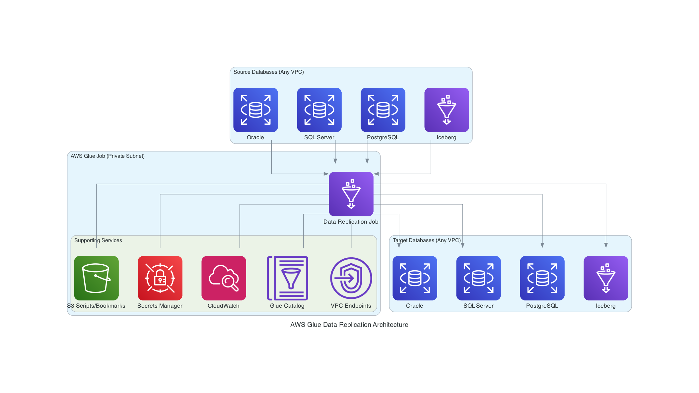

# Architecture Documentation

This document provides comprehensive technical architecture details for the AWS Glue Data Replication project, including the modular design, component interactions, and implementation patterns derived from the project refactoring initiative.

## Table of Contents

1. [System Overview](#system-overview)
2. [Modular Architecture](#modular-architecture)
3. [Component Details](#component-details)
4. [Data Flow Architecture](#data-flow-architecture)
5. [Error Handling Architecture](#error-handling-architecture)
6. [Performance Architecture](#performance-architecture)
7. [Storage Architecture](#storage-architecture)
8. [Monitoring Architecture](#monitoring-architecture)
9. [Security Architecture](#security-architecture)
10. [Deployment Architecture](#deployment-architecture)

## System Overview

The AWS Glue Data Replication system is designed as a modular, scalable solution for replicating data between different database systems using AWS Glue. The architecture follows modern software engineering principles including separation of concerns, dependency injection, and graceful degradation.

### Key Architectural Principles

1. **Modular Design**: Each component has a single, well-defined responsibility
2. **Loose Coupling**: Components interact through well-defined interfaces
3. **High Cohesion**: Related functionality is grouped together
4. **Graceful Degradation**: System continues to function even when optional components fail
5. **Performance Optimization**: Parallel and asynchronous operations where beneficial
6. **Observability**: Comprehensive logging, metrics, and monitoring throughout

### System Context



*The diagram shows the high-level system architecture: source databases connect to AWS Glue for processing, which writes to target databases. S3 provides bookmark storage for incremental processing, and CloudWatch handles monitoring, metrics, and alerting.*

## Modular Architecture

### Package Structure

The system is organized into focused packages, each handling specific aspects of the data replication process:

```
src/glue_job/
├── main.py                    # Entry point and orchestration (< 200 lines)
├── config/                    # Configuration management
│   ├── __init__.py
│   ├── job_config.py          # Job configuration dataclasses
│   ├── database_engines.py    # Database engine management
│   └── parsers.py             # Configuration parsing utilities
├── storage/                   # Bookmark and storage management
│   ├── __init__.py
│   ├── s3_bookmark.py         # S3 bookmark operations
│   └── bookmark_manager.py    # Bookmark lifecycle management
├── database/                  # Database operations
│   ├── __init__.py
│   ├── connection_manager.py  # Database connection management
│   ├── schema_validator.py    # Schema validation and mapping
│   ├── migration.py           # Data migration operations
│   └── incremental_detector.py # Incremental loading detection
├── monitoring/                # Observability and metrics
│   ├── __init__.py
│   ├── logging.py             # Structured logging
│   ├── metrics.py             # CloudWatch metrics publishing
│   └── progress.py            # Progress tracking
├── network/                   # Error handling and resilience
│   ├── __init__.py
│   ├── error_handler.py       # Error classification and handling
│   └── retry_handler.py       # Retry mechanisms and recovery
└── utils/                     # Shared utilities
    ├── __init__.py
    └── s3_utils.py            # S3 operations and utilities
```

### Dependency Graph

```
main.py
├── config/
│   ├── parsers.py ──────────┐
│   ├── job_config.py ───────┼─── database_engines.py
│   └── database_engines.py ─┘
├── storage/
│   ├── bookmark_manager.py ─┬─── s3_bookmark.py
│   └── s3_bookmark.py ──────┼─── utils/s3_utils.py
│                            └─── monitoring/logging.py
├── database/
│   ├── connection_manager.py ┬─── network/error_handler.py
│   ├── migration.py ─────────┼─── network/retry_handler.py
│   ├── schema_validator.py ──┼─── monitoring/metrics.py
│   └── incremental_detector.py ┘
├── monitoring/
│   ├── logging.py
│   ├── metrics.py ───────────── monitoring/logging.py
│   └── progress.py
├── network/
│   ├── error_handler.py
│   └── retry_handler.py ───── network/error_handler.py
└── utils/
    └── s3_utils.py
```

## Component Details

### Configuration Layer

#### JobConfigurationParser
**Purpose**: Parse and validate job configuration from CloudFormation parameters

**Key Responsibilities**:
- Parse CloudFormation stack parameters
- Validate configuration completeness
- Create typed configuration objects
- Handle default values and optional parameters

**Interface**:
```python
class JobConfigurationParser:
    def parse_configuration(self, args: Dict[str, Any]) -> JobConfig:
        """Parse job configuration from CloudFormation arguments"""
        
    def validate_configuration(self, config: JobConfig) -> bool:
        """Validate configuration completeness and consistency"""
```

#### DatabaseEngineManager
**Purpose**: Manage database engine configurations and JDBC drivers

**Key Responsibilities**:
- Load database engine configurations from JSON
- Manage JDBC driver class mappings
- Build connection URLs for different database types
- Handle engine-specific connection parameters

**Architecture Pattern**: Registry Pattern
```python
class DatabaseEngineManager:
    def __init__(self):
        self._engines = self._load_engine_configurations()
        self._drivers = self._load_driver_mappings()
    
    def get_driver_class(self, engine_type: str) -> str:
        """Get JDBC driver class for specific engine"""
        
    def build_connection_url(self, config: ConnectionConfig) -> str:
        """Build engine-specific JDBC connection URL"""
```

### Storage Layer

#### S3BookmarkStorage
**Purpose**: Persistent bookmark storage using Amazon S3

**Key Responsibilities**:
- Read/write bookmark states to S3
- Handle S3 errors with appropriate fallback
- Implement retry logic with exponential backoff
- Validate bookmark data integrity
- Support parallel and batch operations

**Architecture Pattern**: Repository Pattern with Circuit Breaker
```python
class S3BookmarkStorage:
    def __init__(self, config: S3BookmarkConfig):
        self.config = config
        self.s3_client = boto3.client('s3')
        self.circuit_breaker = CircuitBreaker()
    
    async def read_bookmark(self, table_name: str) -> Optional[JobBookmarkState]:
        """Read bookmark with circuit breaker protection"""
        
    async def write_bookmark(self, bookmark: JobBookmarkState) -> bool:
        """Write bookmark with retry logic"""
```

#### JobBookmarkManager
**Purpose**: Orchestrate bookmark lifecycle and state management

**Key Responsibilities**:
- Initialize bookmark states for tables
- Manage transitions between first-run and incremental loading
- Coordinate S3 and in-memory bookmark storage
- Handle parallel bookmark operations
- Provide fallback mechanisms

> **📖 For detailed information about the bookmark system, including automatic incremental column detection and loading strategies, see [Bookmark Details](BOOKMARK_DETAILS.md).**

**Architecture Pattern**: Facade Pattern with Strategy Pattern
```python
class JobBookmarkManager:
    def __init__(self, glue_context: GlueContext, job_name: str, 
                 source_jdbc_path: Optional[str] = None):
        self.storage_strategy = self._determine_storage_strategy(source_jdbc_path)
        self.parallel_ops = self._initialize_parallel_operations()
    
    def _determine_storage_strategy(self, jdbc_path: Optional[str]) -> BookmarkStorage:
        """Strategy pattern for storage selection"""
        if jdbc_path and self._can_use_s3_storage(jdbc_path):
            return S3BookmarkStorage(self._create_s3_config(jdbc_path))
        return InMemoryBookmarkStorage()
```

### Database Layer

#### UnifiedConnectionManager (Enhanced)
**Purpose**: Orchestrate connection creation using appropriate strategy based on configuration

**Key Responsibilities**:
- Determine connection strategy based on engine type and Glue configuration
- Route connection creation to appropriate manager (Glue Connection vs Direct JDBC)
- Maintain backward compatibility with existing JDBC connections
- Handle mixed connection scenarios (source uses Glue, target uses direct JDBC)

**Architecture Pattern**: Strategy Pattern with Factory Method
```python
class UnifiedConnectionManager:
    def __init__(self, glue_context: GlueContext):
        self.glue_context = glue_context
        self.glue_connection_manager = GlueConnectionManager(glue_context)
        self.jdbc_connection_manager = JdbcConnectionManager(glue_context)
        self.iceberg_connection_handler = IcebergConnectionHandler(glue_context)
    
    def _determine_connection_strategy(self, connection_config: ConnectionConfig) -> str:
        """Determine connection strategy based on engine type and Glue config"""
        if self.is_iceberg_engine(connection_config.engine_type):
            return "iceberg"
        elif connection_config.uses_glue_connection():
            return connection_config.get_glue_connection_strategy()
        else:
            return "direct_jdbc"
            
    def create_connection(self, connection_config: ConnectionConfig) -> Any:
        """Enhanced connection creation with Glue Connection support"""
        strategy = self._determine_connection_strategy(connection_config)
        
        if strategy == "iceberg":
            return self.iceberg_connection_handler.create_connection(connection_config)
        elif strategy in ["create_glue", "use_glue"]:
            return self.glue_connection_manager.setup_jdbc_with_glue_connection_strategy(connection_config)
        else:
            return self.jdbc_connection_manager.create_connection(connection_config)
```

#### GlueConnectionManager (Enhanced)
**Purpose**: Manage AWS Glue Connections for JDBC databases

**Key Responsibilities**:
- Create new AWS Glue Connections from JDBC parameters
- Validate and use existing AWS Glue Connections
- Handle Glue Connection-specific error scenarios
- Integrate with existing JDBC connection setup
- Implement retry logic for Glue API operations

**Architecture Pattern**: Facade Pattern with Circuit Breaker
```python
class GlueConnectionManager:
    def __init__(self, glue_context: GlueContext):
        self.glue_context = glue_context
        self.glue_client = boto3.client('glue')
        self.circuit_breaker = CircuitBreaker()
        self.retry_handler = GlueConnectionRetryHandler()
    
    def create_glue_connection(self, connection_config: ConnectionConfig, 
                             connection_name: str) -> str:
        """Create a new Glue Connection from JDBC parameters"""
        
    def validate_glue_connection_exists(self, connection_name: str) -> bool:
        """Validate that a Glue Connection exists"""
        
    def setup_jdbc_with_glue_connection_strategy(self, connection_config: ConnectionConfig) -> DataFrame:
        """Setup JDBC using the appropriate Glue Connection strategy"""
```

#### JdbcConnectionManager
**Purpose**: Manage direct JDBC connections to source and target databases (existing functionality)

**Key Responsibilities**:
- Create and validate direct JDBC connections
- Handle connection pooling and lifecycle
- Implement connection retry logic
- Support multiple database engines
- Manage connection security and encryption

**Architecture Pattern**: Factory Pattern with Connection Pool
```python
class JdbcConnectionManager:
    def __init__(self, glue_context: GlueContext):
        self.glue_context = glue_context
        self.connection_pool = ConnectionPool()
        self.retry_handler = ConnectionRetryHandler()
    
    def create_connection(self, config: ConnectionConfig) -> DataFrame:
        """Factory method for creating database connections"""
        
    def validate_connection(self, config: ConnectionConfig) -> bool:
        """Validate connection with retry logic"""
```

#### DataMigrator Classes
**Purpose**: Execute data migration operations (full-load and incremental)

**Key Responsibilities**:
- Execute full-load data migration
- Handle incremental data loading with bookmark management
- Implement data transformation and validation
- Monitor migration progress and performance
- Handle migration errors and recovery

**Architecture Pattern**: Template Method Pattern
```python
class DataMigrator:
    def execute_migration(self, source_df: DataFrame, 
                         target_config: ConnectionConfig) -> ProcessingMetrics:
        """Template method for migration process"""
        self.pre_migration_setup()
        metrics = self.perform_migration(source_df, target_config)
        self.post_migration_cleanup()
        return metrics
    
    def perform_migration(self, source_df: DataFrame, 
                         target_config: ConnectionConfig) -> ProcessingMetrics:
        """Abstract method implemented by subclasses"""
        raise NotImplementedError
```

### Glue Connection Architecture

#### Connection Strategy Decision Flow

```
┌─────────────────────────────────────────────────────────────────┐
│                    Parameter Processing                          │
│  ┌─────────────────────────────────────────────────────────┐    │
│  │  Parse Glue Connection Parameters                       │    │
│  │  - createSourceConnection/createTargetConnection        │    │
│  │  - useSourceConnection/useTargetConnection              │    │
│  │  - Validate mutual exclusivity                          │    │
│  └─────────────────────────────────────────────────────────┘    │
└─────────────────────────────────────────────────────────────────┘
                                    │
                                    ▼
┌─────────────────────────────────────────────────────────────────┐
│                  Connection Strategy Determination               │
│                                                                 │
│  ┌─────────────┐    ┌─────────────┐    ┌─────────────────────┐  │
│  │   Iceberg   │    │    JDBC     │    │   JDBC + Glue       │  │
│  │   Engine    │    │   Engine    │    │   Connection        │  │
│  │             │    │             │    │   Parameters        │  │
│  └─────────────┘    └─────────────┘    └─────────────────────┘  │
│         │                   │                       │           │
│         ▼                   ▼                       ▼           │
│  ┌─────────────┐    ┌─────────────┐    ┌─────────────────────┐  │
│  │  Existing   │    │   Direct    │    │   Glue Connection   │  │
│  │  Iceberg    │    │    JDBC     │    │   Strategy          │  │
│  │ Mechanism   │    │ Connection  │    │                     │  │
│  └─────────────┘    └─────────────┘    └─────────────────────┘  │
└─────────────────────────────────────────────────────────────────┘
                                    │
                                    ▼
┌─────────────────────────────────────────────────────────────────┐
│                  Glue Connection Strategy Routing               │
│                                                                 │
│  ┌─────────────────────┐              ┌─────────────────────┐   │
│  │  createConnection   │              │  useConnection      │   │
│  │      = true         │              │      = name         │   │
│  └─────────────────────┘              └─────────────────────┘   │
│           │                                      │               │
│           ▼                                      ▼               │
│  ┌─────────────────────┐              ┌─────────────────────┐   │
│  │  Create New Glue    │              │  Use Existing Glue  │   │
│  │  Connection with    │              │  Connection         │   │
│  │  Secrets Manager    │              │                     │   │
│  └─────────────────────┘              └─────────────────────┘   │
└─────────────────────────────────────────────────────────────────┘
                                    │
                                    ▼
┌─────────────────────────────────────────────────────────────────┐
│                    Database Connection Execution                 │
│                                                                 │
│  All strategies converge to standard JDBC DataFrame creation    │
│  using Glue Context with appropriate connection properties      │
└─────────────────────────────────────────────────────────────────┘
```

#### AWS Secrets Manager Integration Architecture

```
┌─────────────────────────────────────────────────────────────────┐
│                  Glue Connection Creation Flow                   │
│                                                                 │
│  ┌─────────────────────┐              ┌─────────────────────┐   │
│  │  Extract JDBC       │              │  Validate IAM       │   │
│  │  Parameters from    │─────────────▶│  Permissions for    │   │
│  │  ConnectionConfig   │              │  Secrets Manager    │   │
│  └─────────────────────┘              └─────────────────────┘   │
│                                                 │               │
│                                                 ▼               │
│  ┌─────────────────────┐              ┌─────────────────────┐   │
│  │  Create AWS         │◀─────────────│  Generate Unique    │   │
│  │  Secrets Manager    │              │  Secret Name        │   │
│  │  Secret             │              │  /aws-glue/{name}   │   │
│  └─────────────────────┘              └─────────────────────┘   │
│           │                                      │               │
│           ▼                                      ▼               │
│  ┌─────────────────────┐              ┌─────────────────────┐   │
│  │  Store Credentials  │              │  Create Glue        │   │
│  │  in JSON Format:    │─────────────▶│  Connection with    │   │
│  │  {username, password}│              │  Secret Reference   │   │
│  └─────────────────────┘              └─────────────────────┘   │
│                                                 │               │
│                                                 ▼               │
│  ┌─────────────────────┐              ┌─────────────────────┐   │
│  │  Cleanup Secret     │◀─────────────│  Validate Connection│   │
│  │  on Failure         │   (if fails) │  Creation Success   │   │
│  └─────────────────────┘              └─────────────────────┘   │
└─────────────────────────────────────────────────────────────────┘
```

#### Glue Connection Configuration Architecture

**Enhanced ConnectionConfig Data Model**:
```python
@dataclass
class GlueConnectionConfig:
    """Configuration for Glue Connection operations"""
    create_connection: bool = False
    use_existing_connection: Optional[str] = None
    
    @property
    def connection_strategy(self) -> str:
        if self.create_connection:
            return "create_glue"
        elif self.use_existing_connection:
            return "use_glue"
        else:
            return "direct_jdbc"
    
    def validate(self) -> None:
        """Validate Glue Connection configuration"""
        if self.create_connection and self.use_existing_connection:
            raise ValueError("Cannot both create and use existing Glue Connection")

@dataclass 
class ConnectionConfig:
    # Existing fields...
    glue_connection_config: Optional[GlueConnectionConfig] = None
    
    def uses_glue_connection(self) -> bool:
        """Check if this connection uses Glue Connection"""
        return (self.glue_connection_config is not None and 
                self.glue_connection_config.connection_strategy != "direct_jdbc")
        
    def get_glue_connection_strategy(self) -> str:
        """Get the Glue Connection strategy"""
        if self.glue_connection_config:
            return self.glue_connection_config.connection_strategy
        return "direct_jdbc"
```

#### Glue Connection Creation Architecture with Secrets Manager

**Enhanced Connection Creation Flow**:
```python
def create_glue_connection(self, connection_config: ConnectionConfig, 
                         connection_name: str) -> str:
    """
    Creates a Glue Connection with AWS Secrets Manager integration:
    
    1. Validate Secrets Manager IAM permissions
    2. Extract JDBC parameters from ConnectionConfig
    3. Create AWS Secrets Manager secret with credentials
    4. Build Glue Connection properties with secret reference
    5. Create connection via AWS Glue API
    6. Validate connection creation success
    7. Cleanup secret if connection creation fails
    8. Return connection name for subsequent use
    """
    
    # Step 1: Validate Secrets Manager permissions
    self.secrets_manager_handler.validate_secret_permissions()
    
    # Step 2: Create secret with database credentials
    secret_name = f"/aws-glue/{connection_name}"
    secret_arn = self.secrets_manager_handler.create_secret(
        secret_name=secret_name,
        username=connection_config.username,
        password=connection_config.password
    )
    
    try:
        # Step 3: Build Glue Connection properties with secret reference
        connection_properties = {
            'JDBC_CONNECTION_URL': connection_config.connection_string,
            'SECRET_ID': secret_arn,  # Reference to Secrets Manager secret
            'JDBC_ENFORCE_SSL': 'true'
        }
        
        # Add network configuration if available
        physical_requirements = {}
        if connection_config.network_config:
            physical_requirements = {
                'SubnetId': connection_config.network_config.subnet_id,
                'SecurityGroupIdList': connection_config.network_config.security_groups,
                'AvailabilityZone': connection_config.network_config.availability_zone
            }
        
        # Step 4: Create Glue Connection
        response = self.glue_client.create_connection(
            ConnectionInput={
                'Name': connection_name,
                'ConnectionType': 'JDBC',
                'ConnectionProperties': connection_properties,
                'PhysicalConnectionRequirements': physical_requirements
            }
        )
        
        return connection_name
        
    except Exception as e:
        # Step 5: Cleanup secret on failure
        try:
            self.secrets_manager_handler.delete_secret(secret_name)
        except Exception as cleanup_error:
            self.logger.error(f"Failed to cleanup secret {secret_name}: {cleanup_error}")
        
        raise GlueConnectionCreationError(connection_name, str(e))
```

#### AWS Secrets Manager Handler Architecture

**SecretsManagerHandler Implementation**:
```python
class SecretsManagerHandler:
    """
    Architecture pattern: Facade Pattern with Circuit Breaker and Retry Logic
    """
    
    def __init__(self, region_name: str):
        self.region_name = region_name
        self.secrets_client = boto3.client('secretsmanager', region_name=region_name)
        self.circuit_breaker = CircuitBreaker(
            failure_threshold=3,
            timeout=60,
            expected_exception=SecretsManagerError
        )
        self.retry_handler = SecretsManagerRetryHandler()
    
    def create_secret(self, secret_name: str, username: str, password: str) -> str:
        """
        Create AWS Secrets Manager secret with database credentials
        
        Architecture:
        1. Generate unique secret name with timestamp
        2. Create secret value in JSON format
        3. Execute creation with circuit breaker protection
        4. Return secret ARN for Glue Connection reference
        """
        
        # Generate timestamped secret name to avoid conflicts
        timestamped_name = f"{secret_name}-{int(time.time())}"
        
        # Create secret value in required JSON format
        secret_value = {
            "username": username,
            "password": password
        }
        
        # Execute with circuit breaker and retry logic
        def create_operation():
            response = self.secrets_client.create_secret(
                Name=timestamped_name,
                Description=f"Database credentials for Glue Connection",
                SecretString=json.dumps(secret_value),
                Tags=[
                    {
                        'Key': 'CreatedBy',
                        'Value': 'GlueDataReplication'
                    },
                    {
                        'Key': 'Purpose',
                        'Value': 'GlueConnection'
                    }
                ]
            )
            return response['ARN']
        
        try:
            return self.circuit_breaker.call(
                lambda: self.retry_handler.execute_with_retry(
                    create_operation, 
                    "create_secret"
                )
            )
        except Exception as e:
            raise SecretCreationError(f"Failed to create secret {timestamped_name}: {str(e)}")
    
    def validate_secret_permissions(self) -> bool:
        """
        Validate IAM permissions for Secrets Manager operations
        
        Architecture:
        1. Test permissions with dry-run operations
        2. Validate required actions: CreateSecret, GetSecretValue, DeleteSecret
        3. Return validation result with detailed error information
        """
        
        required_actions = [
            'secretsmanager:CreateSecret',
            'secretsmanager:GetSecretValue', 
            'secretsmanager:DescribeSecret',
            'secretsmanager:DeleteSecret'
        ]
        
        try:
            # Test with a dummy secret name to validate permissions
            test_secret_name = f"/aws-glue/permission-test-{int(time.time())}"
            
            # This will fail if permissions are insufficient
            self.secrets_client.describe_secret(SecretId=test_secret_name)
            
        except ClientError as e:
            error_code = e.response['Error']['Code']
            
            if error_code == 'ResourceNotFoundException':
                # Expected - secret doesn't exist, but we have permissions
                return True
            elif error_code in ['AccessDenied', 'UnauthorizedOperation']:
                raise SecretsManagerPermissionError(
                    f"Insufficient IAM permissions for Secrets Manager. Required actions: {required_actions}"
                )
            else:
                # Other errors indicate permission or service issues
                raise SecretsManagerError(f"Secrets Manager validation failed: {str(e)}")
        
        return True
    
    def delete_secret(self, secret_name: str, force_delete: bool = True) -> bool:
        """
        Delete AWS Secrets Manager secret with optional force delete
        
        Architecture:
        1. Execute deletion with circuit breaker protection
        2. Support immediate deletion (force_delete=True) for cleanup scenarios
        3. Handle deletion errors gracefully for cleanup operations
        """
        
        def delete_operation():
            response = self.secrets_client.delete_secret(
                SecretId=secret_name,
                ForceDeleteWithoutRecovery=force_delete
            )
            return response['DeletionDate'] is not None
        
        try:
            return self.circuit_breaker.call(
                lambda: self.retry_handler.execute_with_retry(
                    delete_operation,
                    "delete_secret"
                )
            )
        except ClientError as e:
            error_code = e.response['Error']['Code']
            
            if error_code == 'ResourceNotFoundException':
                # Secret already deleted or doesn't exist
                return True
            else:
                self.logger.warning(f"Failed to delete secret {secret_name}: {str(e)}")
                return False
        except Exception as e:
            self.logger.warning(f"Failed to delete secret {secret_name}: {str(e)}")
            return False
```

#### Secrets Manager Error Handling Architecture

**Error Hierarchy and Handling**:
```python
class SecretsManagerError(Exception):
    """Base exception for Secrets Manager operations"""
    pass

class SecretCreationError(SecretsManagerError):
    """Raised when secret creation fails"""
    def __init__(self, message: str):
        self.message = message
        super().__init__(f"Secret creation failed: {message}")

class SecretsManagerPermissionError(SecretsManagerError):
    """Raised when IAM permissions are insufficient"""
    def __init__(self, message: str):
        self.message = message
        super().__init__(f"Secrets Manager permission error: {message}")

class SecretsManagerRetryHandler:
    """
    Architecture pattern: Exponential Backoff with Jitter
    """
    
    def __init__(self):
        self.max_attempts = 3
        self.base_delay = 1.0
        self.max_delay = 30.0
        self.backoff_factor = 2.0
        self.jitter_factor = 0.1
    
    def execute_with_retry(self, operation: Callable, operation_name: str):
        """Execute Secrets Manager operation with retry logic"""
        
        for attempt in range(self.max_attempts):
            try:
                return operation()
                
            except ClientError as e:
                error_code = e.response['Error']['Code']
                
                # Determine if error is retryable
                if error_code in ['Throttling', 'ServiceUnavailable', 'InternalFailure']:
                    if attempt < self.max_attempts - 1:
                        delay = self._calculate_backoff_delay(attempt)
                        time.sleep(delay)
                        continue
                
                # Non-retryable error or max attempts reached
                raise SecretsManagerError(f"{operation_name} failed: {str(e)}")
                
            except Exception as e:
                # Unexpected error - don't retry
                raise SecretsManagerError(f"{operation_name} failed: {str(e)}")
    
    def _calculate_backoff_delay(self, attempt: int) -> float:
        """Calculate exponential backoff delay with jitter"""
        delay = min(
            self.base_delay * (self.backoff_factor ** attempt),
            self.max_delay
        )
        
        # Add jitter to prevent thundering herd
        jitter = delay * self.jitter_factor * random.random()
        return delay + jitter
```

#### Error Handling Architecture for Glue Connections

**Glue Connection Error Hierarchy**:
```python
class GlueConnectionError(Exception):
    """Base exception for Glue Connection operations"""
    pass

class GlueConnectionCreationError(GlueConnectionError):
    """Raised when Glue Connection creation fails"""
    def __init__(self, connection_name: str, reason: str):
        self.connection_name = connection_name
        self.reason = reason
        super().__init__(f"Failed to create Glue Connection '{connection_name}': {reason}")

class GlueConnectionNotFoundError(GlueConnectionError):
    """Raised when specified Glue Connection doesn't exist"""
    def __init__(self, connection_name: str):
        self.connection_name = connection_name
        super().__init__(f"Glue Connection '{connection_name}' not found")

class GlueConnectionValidationError(GlueConnectionError):
    """Raised when Glue Connection validation fails"""
    def __init__(self, connection_name: str, validation_error: str):
        self.connection_name = connection_name
        self.validation_error = validation_error
        super().__init__(f"Glue Connection '{connection_name}' validation failed: {validation_error}")
```

**Circuit Breaker Pattern for Glue API Operations**:
```python
class GlueConnectionRetryHandler:
    def __init__(self):
        self.circuit_breaker = CircuitBreaker(
            failure_threshold=3,
            timeout=60,
            expected_exception=GlueConnectionError
        )
        self.retry_config = {
            'max_attempts': 3,
            'backoff_factor': 2.0,
            'base_delay': 1.0
        }
    
    def execute_with_retry(self, operation: Callable, operation_name: str):
        """Execute Glue Connection operation with circuit breaker and retry logic"""
        return self.circuit_breaker.call(
            lambda: self._retry_operation(operation, operation_name)
        )
    
    def _retry_operation(self, operation: Callable, operation_name: str):
        """Internal retry logic for Glue Connection operations"""
        for attempt in range(self.retry_config['max_attempts']):
            try:
                return operation()
            except ClientError as e:
                error_code = e.response['Error']['Code']
                
                if error_code in ['Throttling', 'ServiceUnavailable', 'InternalFailure']:
                    if attempt < self.retry_config['max_attempts'] - 1:
                        delay = self._calculate_backoff_delay(attempt)
                        time.sleep(delay)
                        continue
                
                # Non-retryable error or max attempts reached
                raise GlueConnectionError(f"{operation_name} failed: {str(e)}")
            except Exception as e:
                raise GlueConnectionError(f"{operation_name} failed: {str(e)}")
```

#### Backward Compatibility Architecture

**Compatibility Guarantees**:
```python
class BackwardCompatibilityManager:
    """Ensures backward compatibility with existing JDBC connections"""
    
    def __init__(self):
        self.compatibility_checks = [
            self._check_parameter_compatibility,
            self._check_iceberg_compatibility,
            self._check_existing_job_compatibility
        ]
    
    def validate_compatibility(self, job_config: JobConfig) -> CompatibilityReport:
        """Validate that Glue Connection enhancements maintain compatibility"""
        report = CompatibilityReport()
        
        for check in self.compatibility_checks:
            check_result = check(job_config)
            report.add_check_result(check_result)
        
        return report
    
    def _check_parameter_compatibility(self, job_config: JobConfig) -> CheckResult:
        """Ensure existing parameter files continue to work"""
        # When no Glue Connection parameters are provided, 
        # system should default to existing direct JDBC behavior
        
        for connection_config in [job_config.source_config, job_config.target_config]:
            if not connection_config.uses_glue_connection():
                # Verify all required JDBC parameters are present
                required_params = ['connection_string', 'username', 'password']
                missing_params = [p for p in required_params 
                                if not hasattr(connection_config, p) or 
                                getattr(connection_config, p) is None]
                
                if missing_params:
                    return CheckResult(
                        status='FAIL',
                        message=f"Missing required JDBC parameters: {missing_params}"
                    )
        
        return CheckResult(status='PASS', message="Parameter compatibility maintained")
    
    def _check_iceberg_compatibility(self, job_config: JobConfig) -> CheckResult:
        """Ensure Iceberg connections remain unchanged"""
        # Iceberg connections should ignore Glue Connection parameters
        # and continue using existing connection mechanism
        
        for connection_config in [job_config.source_config, job_config.target_config]:
            if connection_config.engine_type == 'iceberg':
                if connection_config.uses_glue_connection():
                    # This should log a warning but not fail
                    return CheckResult(
                        status='WARNING',
                        message="Glue Connection parameters ignored for Iceberg engine"
                    )
        
        return CheckResult(status='PASS', message="Iceberg compatibility maintained")
```

### Monitoring Layer

#### StructuredLogger
**Purpose**: Provide structured logging with contextual information

**Key Responsibilities**:
- Generate structured log entries with job context
- Support different log levels and categories
- Integrate with AWS CloudWatch Logs
- Provide specialized logging methods for different operations
- Handle log formatting and serialization

**Architecture Pattern**: Decorator Pattern
```python
class StructuredLogger:
    def __init__(self, job_name: str, job_run_id: str):
        self.context = {
            'job_name': job_name,
            'job_run_id': job_run_id,
            'timestamp': datetime.utcnow().isoformat()
        }
    
    def log_with_context(self, level: str, message: str, **kwargs):
        """Add context to all log messages"""
        log_entry = {**self.context, 'message': message, **kwargs}
        getattr(logging, level)(json.dumps(log_entry))
```

#### CloudWatchMetricsPublisher
**Purpose**: Publish performance and operational metrics to CloudWatch

**Key Responsibilities**:
- Collect and buffer metrics during job execution
- Publish metrics to CloudWatch in batches
- Handle metric publishing errors gracefully
- Support custom metrics and dimensions
- Provide performance monitoring capabilities

**Architecture Pattern**: Observer Pattern with Buffering
```python
class CloudWatchMetricsPublisher:
    def __init__(self, namespace: str):
        self.namespace = namespace
        self.metric_buffer = []
        self.cloudwatch = boto3.client('cloudwatch')
    
    def publish_metric(self, metric_name: str, value: float, 
                      dimensions: Dict[str, str] = None):
        """Buffer metric for batch publishing"""
        
    def flush_metrics(self):
        """Publish buffered metrics to CloudWatch"""
```

### Network Layer

#### NetworkErrorHandler
**Purpose**: Classify and handle network-related errors

**Key Responsibilities**:
- Classify errors as retryable or non-retryable
- Provide error-specific handling strategies
- Generate appropriate error responses
- Support error recovery mechanisms
- Integrate with monitoring and alerting

**Architecture Pattern**: Chain of Responsibility
```python
class NetworkErrorHandler:
    def __init__(self):
        self.error_handlers = [
            TimeoutErrorHandler(),
            ConnectionErrorHandler(),
            AuthenticationErrorHandler(),
            GenericErrorHandler()
        ]
    
    def handle_error(self, error: Exception) -> ErrorResponse:
        """Chain of responsibility for error handling"""
        for handler in self.error_handlers:
            if handler.can_handle(error):
                return handler.handle(error)
        return self.default_handler.handle(error)
```

#### ConnectionRetryHandler
**Purpose**: Implement retry logic with exponential backoff

**Key Responsibilities**:
- Execute operations with retry logic
- Implement exponential backoff algorithms
- Handle retry limits and timeout conditions
- Provide retry statistics and monitoring
- Support different retry strategies

**Architecture Pattern**: Decorator Pattern with Strategy Pattern
```python
class ConnectionRetryHandler:
    def __init__(self, max_retries: int = 3, base_delay: float = 1.0):
        self.max_retries = max_retries
        self.base_delay = base_delay
        self.backoff_strategy = ExponentialBackoffStrategy()
    
    def retry_operation(self, operation: Callable, *args, **kwargs):
        """Execute operation with retry logic"""
        for attempt in range(self.max_retries + 1):
            try:
                return operation(*args, **kwargs)
            except RetryableException as e:
                if attempt < self.max_retries:
                    delay = self.backoff_strategy.calculate_delay(attempt)
                    time.sleep(delay)
                else:
                    raise e
```

## Data Flow Architecture

### High-Level Data Flow

```
┌─────────────────┐    ┌─────────────────┐    ┌─────────────────┐
│   CloudFormation│    │   Job Config    │    │  Database Engine│
│   Parameters    │───▶│   Parser        │───▶│   Manager       │
└─────────────────┘    └─────────────────┘    └─────────────────┘
                                │
                                ▼
┌─────────────────┐    ┌─────────────────┐    ┌─────────────────┐
│   Bookmark      │    │   Job Bookmark  │    │  S3 Bookmark    │
│   Initialization│◀───│   Manager       │───▶│   Storage       │
└─────────────────┘    └─────────────────┘    └─────────────────┘
         │                       │
         ▼                       ▼
┌─────────────────┐    ┌─────────────────┐    ┌─────────────────┐
│   Source DB     │    │   JDBC          │    │   Target DB     │
│   Connection    │───▶│   Connection    │───▶│   Connection    │
│                 │    │   Manager       │    │                 │
└─────────────────┘    └─────────────────┘    └─────────────────┘
         │                       │                       │
         ▼                       ▼                       ▼
┌─────────────────┐    ┌─────────────────┐    ┌─────────────────┐
│   Data          │    │   Data          │    │   Data          │
│   Extraction    │───▶│   Migration     │───▶│   Loading       │
└─────────────────┘    └─────────────────┘    └─────────────────┘
         │                       │                       │
         ▼                       ▼                       ▼
┌─────────────────┐    ┌─────────────────┐    ┌─────────────────┐
│   Progress      │    │   Metrics       │    │   Bookmark      │
│   Tracking      │───▶│   Publishing    │───▶│   Update        │
└─────────────────┘    └─────────────────┘    └─────────────────┘
```

### Detailed Processing Flow

#### 1. Job Initialization Phase
```python
def initialize_job():
    # Parse configuration
    config = JobConfigurationParser().parse_configuration(args)
    
    # Initialize bookmark manager
    bookmark_manager = JobBookmarkManager(
        glue_context, config.job_name,
        source_jdbc_path=config.source_connection.jdbc_driver_path
    )
    
    # Pre-load bookmark states for all tables
    if len(table_configs) > 10:
        bookmark_states = bookmark_manager.initialize_bookmark_states_parallel(table_configs)
    else:
        bookmark_states = {
            table['name']: bookmark_manager.initialize_bookmark_state(
                table['name'], table['strategy'], table.get('column')
            ) for table in table_configs
        }
    
    return config, bookmark_manager, bookmark_states
```

#### 2. Table Processing Phase
```python
def process_table(table_config, bookmark_state):
    # Create database connections
    source_df = connection_manager.create_connection(config.source_connection)
    
    # Apply incremental filtering if not first run
    if not bookmark_state.is_first_run:
        source_df = incremental_detector.apply_incremental_filter(
            source_df, bookmark_state
        )
    
    # Execute data migration
    if bookmark_state.is_first_run:
        metrics = full_load_migrator.execute_migration(source_df, config.target_connection)
    else:
        metrics = incremental_migrator.execute_migration(source_df, config.target_connection)
    
    # Update bookmark state
    bookmark_manager.update_bookmark_state(
        table_config['name'], 
        metrics.last_processed_value,
        metrics.rows_processed
    )
    
    return metrics
```

#### 3. Job Completion Phase
```python
def complete_job(bookmark_updates):
    # Batch update S3 bookmarks
    if len(bookmark_updates) > 5:
        bookmark_manager.update_bookmark_states_batch(bookmark_updates)
    
    # Publish final metrics
    metrics_publisher.publish_job_completion_metrics(total_metrics)
    
    # Log job summary
    structured_logger.log_job_completion(total_metrics, duration)
```

## Error Handling Architecture

### Error Classification Hierarchy

```
Exception
├── RetryableException
│   ├── NetworkTimeoutException
│   ├── ConnectionResetException
│   └── TemporaryServiceException
├── NonRetryableException
│   ├── AuthenticationException
│   ├── AuthorizationException
│   └── ConfigurationException
└── DataException
    ├── SchemaValidationException
    ├── DataCorruptionException
    └── BookmarkValidationException
```

### Error Handling Flow

```
┌─────────────────┐    ┌─────────────────┐    ┌─────────────────┐
│   Operation     │    │   Error         │    │   Error         │
│   Execution     │───▶│   Detection     │───▶│   Classification│
└─────────────────┘    └─────────────────┘    └─────────────────┘
                                │                       │
                                ▼                       ▼
┌─────────────────┐    ┌─────────────────┐    ┌─────────────────┐
│   Fallback      │◀───│   Recovery      │◀───│   Retry Logic   │
│   Mechanism     │    │   Strategy      │    │   (if retryable)│
└─────────────────┘    └─────────────────┘    └─────────────────┘
         │                       │                       │
         ▼                       ▼                       ▼
┌─────────────────┐    ┌─────────────────┐    ┌─────────────────┐
│   Error         │    │   Metrics       │    │   Job           │
│   Logging       │    │   Publishing    │    │   Continuation  │
└─────────────────┘    └─────────────────┘    └─────────────────┘
```

### Circuit Breaker Pattern Implementation

```python
class CircuitBreaker:
    def __init__(self, failure_threshold: int = 5, timeout: int = 60):
        self.failure_threshold = failure_threshold
        self.timeout = timeout
        self.failure_count = 0
        self.last_failure_time = None
        self.state = CircuitState.CLOSED
    
    def call(self, operation: Callable):
        if self.state == CircuitState.OPEN:
            if time.time() - self.last_failure_time > self.timeout:
                self.state = CircuitState.HALF_OPEN
            else:
                raise CircuitBreakerOpenException()
        
        try:
            result = operation()
            self._on_success()
            return result
        except Exception as e:
            self._on_failure()
            raise e
```

## Performance Architecture

### Parallel Processing Strategy

#### S3 Bookmark Operations
```python
class EnhancedS3ParallelOperations:
    async def read_bookmarks_parallel_optimized(self, table_names: List[str], 
                                              max_concurrent: int = 20,
                                              chunk_size: int = 50):
        """Optimized parallel reading with chunking and concurrency control"""
        semaphore = asyncio.Semaphore(max_concurrent)
        
        async def read_with_semaphore(table_name):
            async with semaphore:
                return await self.s3_storage.read_bookmark(table_name)
        
        # Process in chunks to manage memory
        results = {}
        for chunk in self._chunk_list(table_names, chunk_size):
            chunk_tasks = [read_with_semaphore(name) for name in chunk]
            chunk_results = await asyncio.gather(*chunk_tasks, return_exceptions=True)
            
            # Process results and handle exceptions
            for name, result in zip(chunk, chunk_results):
                if isinstance(result, Exception):
                    self.logger.error(f"Failed to read bookmark for {name}: {result}")
                    results[name] = None
                else:
                    results[name] = result
            
            # Rate limiting between chunks
            await asyncio.sleep(0.2)
        
        return results
```

#### Adaptive Concurrency Control
```python
class AdaptiveConcurrencyController:
    def __init__(self):
        self.performance_history = []
        self.current_concurrency = 10
        self.min_concurrency = 1
        self.max_concurrency = 50
    
    def adjust_concurrency(self, operation_metrics: OperationMetrics):
        """Adjust concurrency based on performance metrics"""
        if operation_metrics.error_rate > 0.1:  # High error rate
            self.current_concurrency = max(
                self.min_concurrency, 
                int(self.current_concurrency * 0.8)
            )
        elif operation_metrics.throughput > self.target_throughput:
            self.current_concurrency = min(
                self.max_concurrency,
                int(self.current_concurrency * 1.2)
            )
        
        return self.current_concurrency
```

### Memory Management Architecture

#### DataFrame Size Estimation
```python
def estimate_dataframe_size(df: DataFrame, sample_fraction: float = 0.01) -> int:
    """Estimate DataFrame size using sampling"""
    if df.count() == 0:
        return 0
    
    # Sample the DataFrame
    sample_df = df.sample(fraction=sample_fraction, seed=42)
    sample_rows = sample_df.count()
    
    if sample_rows == 0:
        return 0
    
    # Calculate average row size
    sample_data = sample_df.collect()
    total_sample_size = sum(len(str(row)) for row in sample_data)
    avg_row_size = total_sample_size / sample_rows
    
    # Estimate total size
    total_rows = df.count()
    estimated_size = int(avg_row_size * total_rows)
    
    return estimated_size
```

#### Resource Monitoring
```python
class ResourceMonitor:
    def __init__(self):
        self.memory_threshold = 0.8  # 80% memory usage threshold
        self.cpu_threshold = 0.9     # 90% CPU usage threshold
    
    def check_resource_usage(self) -> ResourceStatus:
        """Monitor system resource usage"""
        memory_usage = psutil.virtual_memory().percent / 100
        cpu_usage = psutil.cpu_percent(interval=1) / 100
        
        if memory_usage > self.memory_threshold:
            return ResourceStatus.MEMORY_PRESSURE
        elif cpu_usage > self.cpu_threshold:
            return ResourceStatus.CPU_PRESSURE
        else:
            return ResourceStatus.NORMAL
```

## Storage Architecture

### S3 Storage Strategy

#### Bucket Organization
```
s3://glue-job-bucket/
├── drivers/                    # JDBC drivers
│   ├── oracle-driver.jar
│   ├── postgresql-driver.jar
│   └── sqlserver-driver.jar
├── bookmarks/                  # Bookmark storage
│   ├── job-name/
│   │   ├── table1.json
│   │   ├── table2.json
│   │   └── table3.json
│   └── another-job/
│       ├── users.json
│       └── orders.json
└── logs/                       # Optional log storage
    └── job-execution-logs/
```

#### Bookmark Data Structure
```json
{
  "table_name": "users",
  "last_processed_value": "2024-01-15T10:30:00Z",
  "incremental_strategy": "timestamp",
  "incremental_column": "updated_at",
  "is_first_run": false,
  "processing_mode": "incremental",
  "rows_processed": 15420,
  "last_update_timestamp": "2024-01-15T10:35:22Z",
  "job_run_id": "jr_2024011510302245",
  "is_manually_configured": true,
  "manual_column_data_type": "TIMESTAMP",
  "metadata": {
    "schema_version": "1.0",
    "data_types": {
      "updated_at": "timestamp"
    },
    "configuration_source": "manual",
    "validation_timestamp": "2024-01-15T10:30:00Z"
  }
}
```

#### Manual Bookmark Configuration Architecture

The system supports both automatic detection and manual configuration of bookmark columns through a hybrid approach:

```python
class BookmarkConfigurationArchitecture:
    """
    Architecture pattern: Strategy Pattern with Fallback Chain
    
    Manual Configuration → JDBC Validation → Automatic Detection → Hash Fallback
    """
    
    def __init__(self):
        self.manual_configs = {}  # ManualBookmarkConfig instances
        self.jdbc_metadata_cache = {}  # Performance optimization
        self.strategy_resolver = BookmarkStrategyResolver()
    
    def resolve_bookmark_strategy(self, table_name: str, connection) -> BookmarkStrategy:
        """
        Resolution chain:
        1. Check manual configuration
        2. Validate against JDBC metadata
        3. Fall back to automatic detection
        4. Ultimate fallback to hash strategy
        """
        
        # Step 1: Manual configuration check
        if table_name in self.manual_configs:
            manual_config = self.manual_configs[table_name]
            
            # Step 2: JDBC validation
            if self._validate_manual_config(manual_config, connection):
                return self._create_manual_strategy(manual_config)
            else:
                # Log fallback and continue to automatic detection
                self._log_manual_config_fallback(table_name, manual_config)
        
        # Step 3: Automatic detection
        return self._detect_automatic_strategy(table_name, connection)
```

#### JDBC Metadata Integration

```python
class JDBCMetadataArchitecture:
    """
    Architecture pattern: Cache-Aside Pattern with Circuit Breaker
    """
    
    def __init__(self):
        self.metadata_cache = {}
        self.circuit_breaker = CircuitBreaker()
        self.performance_metrics = MetricsCollector()
    
    def get_column_metadata(self, connection, table_name: str, column_name: str):
        """
        Cached JDBC metadata retrieval with performance optimization
        """
        cache_key = f"{table_name}.{column_name}"
        
        # Cache hit - return immediately
        if cache_key in self.metadata_cache:
            self.performance_metrics.record_cache_hit()
            return self.metadata_cache[cache_key]
        
        # Cache miss - query database with circuit breaker protection
        try:
            with self.circuit_breaker:
                metadata = self._query_jdbc_metadata(connection, table_name, column_name)
                self.metadata_cache[cache_key] = metadata
                self.performance_metrics.record_cache_miss()
                return metadata
        except CircuitBreakerOpenException:
            # Circuit breaker is open - return cached failure or None
            return self.metadata_cache.get(cache_key)
```

#### Data Type Mapping Architecture

```python
class DataTypeMappingArchitecture:
    """
    Architecture pattern: Strategy Pattern with Database Engine Abstraction
    """
    
    # Comprehensive JDBC type to strategy mapping
    JDBC_TYPE_STRATEGIES = {
        # Timestamp types → timestamp strategy
        'TIMESTAMP': 'timestamp',
        'TIMESTAMP_WITH_TIMEZONE': 'timestamp',
        'DATE': 'timestamp',
        'DATETIME': 'timestamp',
        'DATETIME2': 'timestamp',  # SQL Server
        'TIMESTAMPTZ': 'timestamp',  # PostgreSQL
        
        # Integer types → primary_key strategy
        'INTEGER': 'primary_key',
        'BIGINT': 'primary_key',
        'SERIAL': 'primary_key',  # PostgreSQL
        'BIGSERIAL': 'primary_key',  # PostgreSQL
        'NUMBER': 'primary_key',  # Oracle (context-dependent)
        
        # String and other types → hash strategy
        'VARCHAR': 'hash',
        'VARCHAR2': 'hash',  # Oracle
        'NVARCHAR': 'hash',  # SQL Server
        'TEXT': 'hash',
        'CLOB': 'hash',
        'DECIMAL': 'hash',
        'FLOAT': 'hash',
        'BOOLEAN': 'hash',
        'BINARY': 'hash',
        'BLOB': 'hash'
    }
    
    def map_jdbc_type_to_strategy(self, jdbc_type: str, engine_type: str = None) -> str:
        """
        Map JDBC data type to bookmark strategy with database engine context
        """
        normalized_type = jdbc_type.upper().strip()
        
        # Direct mapping
        if normalized_type in self.JDBC_TYPE_STRATEGIES:
            return self.JDBC_TYPE_STRATEGIES[normalized_type]
        
        # Partial matching for database-specific variations
        for type_pattern, strategy in self.JDBC_TYPE_STRATEGIES.items():
            if type_pattern in normalized_type:
                return strategy
        
        # Default fallback
        return 'hash'
```

#### S3 Operations Optimization
```python
class S3OperationOptimizer:
    def __init__(self):
        self.batch_size = 15
        self.max_concurrent_operations = 20
        self.retry_config = {
            'max_attempts': 3,
            'mode': 'adaptive'
        }
    
    def optimize_batch_size(self, operation_count: int) -> int:
        """Calculate optimal batch size based on operation count"""
        if operation_count <= 5:
            return operation_count
        elif operation_count <= 50:
            return min(self.batch_size, operation_count // 3)
        else:
            return self.batch_size
    
    def optimize_concurrency(self, operation_count: int) -> int:
        """Calculate optimal concurrency based on operation count"""
        return min(
            self.max_concurrent_operations,
            max(1, operation_count // 4)
        )
```

## Monitoring Architecture

### Metrics Hierarchy

```
GlueJob/
├── Execution/
│   ├── JobStarted
│   ├── JobCompleted
│   ├── JobFailed
│   └── JobDuration
├── Tables/
│   ├── TableProcessingStarted
│   ├── TableProcessingCompleted
│   ├── TableProcessingFailed
│   ├── RowsProcessed
│   └── ProcessingDuration
├── Connections/
│   ├── ConnectionAttempts
│   ├── ConnectionSuccesses
│   ├── ConnectionFailures
│   └── ConnectionDuration
├── S3Operations/
│   ├── BookmarkReads
│   ├── BookmarkWrites
│   ├── S3Errors
│   └── S3OperationDuration
└── Performance/
    ├── ThroughputRowsPerSecond
    ├── ThroughputMBPerSecond
    ├── MemoryUsage
    └── CPUUsage
```

### Structured Logging Format

```json
{
  "timestamp": "2024-01-15T10:30:00.123Z",
  "level": "INFO",
  "job_name": "data-replication-job",
  "job_run_id": "jr_2024011510302245",
  "component": "bookmark_manager",
  "operation": "initialize_bookmark_state",
  "message": "Initialized bookmark state for table",
  "table_name": "users",
  "is_first_run": true,
  "incremental_strategy": "timestamp",
  "duration_ms": 245,
  "metadata": {
    "s3_enabled": true,
    "bucket_name": "glue-job-bucket",
    "parallel_operations": true
  }
}
```

### CloudWatch Dashboard Configuration

```python
class CloudWatchDashboard:
    def create_job_dashboard(self, job_name: str):
        """Create CloudWatch dashboard for job monitoring"""
        dashboard_body = {
            "widgets": [
                {
                    "type": "metric",
                    "properties": {
                        "metrics": [
                            ["GlueJob/Execution", "JobDuration", "JobName", job_name],
                            [".", "RowsProcessed", ".", "."],
                            [".", "TablesProcessed", ".", "."]
                        ],
                        "period": 300,
                        "stat": "Average",
                        "region": "us-east-1",
                        "title": "Job Performance Metrics"
                    }
                },
                {
                    "type": "log",
                    "properties": {
                        "query": f"SOURCE '/aws/glue/{job_name}'\n| fields @timestamp, level, message, table_name\n| filter level = \"ERROR\"\n| sort @timestamp desc\n| limit 100",
                        "region": "us-east-1",
                        "title": "Recent Errors"
                    }
                }
            ]
        }
        
        return dashboard_body
```

## Security Architecture

### IAM Permissions Model

#### Enhanced Permissions for Glue Connections and Secrets Manager
```json
{
  "Version": "2012-10-17",
  "Statement": [
    {
      "Effect": "Allow",
      "Action": [
        "s3:GetObject",
        "s3:PutObject",
        "s3:DeleteObject"
      ],
      "Resource": [
        "arn:aws:s3:::glue-job-bucket/bookmarks/*",
        "arn:aws:s3:::glue-job-bucket/drivers/*"
      ]
    },
    {
      "Effect": "Allow",
      "Action": [
        "s3:ListBucket"
      ],
      "Resource": "arn:aws:s3:::glue-job-bucket",
      "Condition": {
        "StringLike": {
          "s3:prefix": [
            "bookmarks/*",
            "drivers/*"
          ]
        }
      }
    },
    {
      "Effect": "Allow",
      "Action": [
        "cloudwatch:PutMetricData"
      ],
      "Resource": "*",
      "Condition": {
        "StringEquals": {
          "cloudwatch:namespace": "GlueJob"
        }
      }
    },
    {
      "Effect": "Allow",
      "Action": [
        "glue:CreateConnection",
        "glue:GetConnection",
        "glue:GetConnections",
        "glue:UpdateConnection",
        "glue:DeleteConnection"
      ],
      "Resource": "*"
    },
    {
      "Effect": "Allow",
      "Action": [
        "secretsmanager:CreateSecret",
        "secretsmanager:GetSecretValue",
        "secretsmanager:DescribeSecret",
        "secretsmanager:DeleteSecret",
        "secretsmanager:UpdateSecret"
      ],
      "Resource": "arn:aws:secretsmanager:*:*:secret:/aws-glue/*"
    },
    {
      "Effect": "Allow",
      "Action": [
        "kms:Decrypt",
        "kms:GenerateDataKey",
        "kms:CreateGrant"
      ],
      "Resource": "arn:aws:kms:*:*:key/*",
      "Condition": {
        "StringEquals": {
          "kms:ViaService": [
            "secretsmanager.*.amazonaws.com",
            "glue.*.amazonaws.com"
          ]
        }
      }
    }
  ]
}
```

#### Secrets Manager Security Architecture

**Encryption and Access Control**:
```python
class SecretsManagerSecurityManager:
    """
    Architecture pattern: Defense in Depth with Least Privilege Access
    """
    
    def __init__(self, kms_key_id: Optional[str] = None):
        self.kms_key_id = kms_key_id
        self.encryption_config = self._build_encryption_config()
        self.access_policy = self._build_access_policy()
    
    def _build_encryption_config(self) -> Dict[str, Any]:
        """
        Configure encryption for Secrets Manager secrets
        
        Security Architecture:
        1. Use customer-managed KMS key if provided
        2. Fall back to AWS-managed key for Secrets Manager
        3. Enable automatic key rotation
        4. Configure cross-service access policies
        """
        
        if self.kms_key_id:
            return {
                'KmsKeyId': self.kms_key_id,
                'EncryptionType': 'KMS_CUSTOMER_MANAGED'
            }
        else:
            return {
                'EncryptionType': 'KMS_AWS_MANAGED'
            }
    
    def create_secure_secret(self, secret_name: str, secret_value: Dict[str, str]) -> str:
        """
        Create secret with enhanced security configuration
        
        Security Features:
        1. Automatic encryption with KMS
        2. Resource tagging for access control
        3. Audit trail configuration
        4. Automatic rotation setup (optional)
        """
        
        create_params = {
            'Name': secret_name,
            'Description': 'Database credentials for AWS Glue Connection',
            'SecretString': json.dumps(secret_value),
            'Tags': [
                {'Key': 'CreatedBy', 'Value': 'GlueDataReplication'},
                {'Key': 'Purpose', 'Value': 'GlueConnection'},
                {'Key': 'Environment', 'Value': os.getenv('ENVIRONMENT', 'dev')},
                {'Key': 'CreatedAt', 'Value': datetime.utcnow().isoformat()}
            ]
        }
        
        # Add KMS encryption if configured
        if self.kms_key_id:
            create_params['KmsKeyId'] = self.kms_key_id
        
        return self.secrets_client.create_secret(**create_params)['ARN']
```

#### Data Encryption Strategy (Enhanced)
```python
class EncryptionManager:
    def __init__(self):
        self.s3_encryption = {
            'ServerSideEncryption': 'AES256'
        }
        self.kms_key_id = os.getenv('KMS_KEY_ID')
        self.secrets_encryption = self._configure_secrets_encryption()
    
    def get_s3_encryption_config(self) -> Dict[str, str]:
        """Get S3 encryption configuration"""
        if self.kms_key_id:
            return {
                'ServerSideEncryption': 'aws:kms',
                'SSEKMSKeyId': self.kms_key_id
            }
        return self.s3_encryption
    
    def _configure_secrets_encryption(self) -> Dict[str, Any]:
        """Configure encryption for Secrets Manager"""
        return {
            'encryption_at_rest': True,
            'encryption_in_transit': True,
            'kms_key_id': self.kms_key_id,
            'automatic_rotation': False  # Can be enabled per secret
        }
```

### Network Security

#### Enhanced VPC Endpoint Configuration for Glue Connections
```python
class NetworkSecurityManager:
    def __init__(self):
        self.vpc_endpoint_config = {
            's3': {
                'service_name': 'com.amazonaws.region.s3',
                'vpc_endpoint_type': 'Gateway'
            },
            'cloudwatch': {
                'service_name': 'com.amazonaws.region.monitoring',
                'vpc_endpoint_type': 'Interface'
            },
            'secretsmanager': {
                'service_name': 'com.amazonaws.region.secretsmanager',
                'vpc_endpoint_type': 'Interface',
                'policy': {
                    "Version": "2012-10-17",
                    "Statement": [
                        {
                            "Effect": "Allow",
                            "Principal": "*",
                            "Action": [
                                "secretsmanager:GetSecretValue",
                                "secretsmanager:DescribeSecret"
                            ],
                            "Resource": "arn:aws:secretsmanager:*:*:secret:/aws-glue/*"
                        }
                    ]
                }
            },
            'glue': {
                'service_name': 'com.amazonaws.region.glue',
                'vpc_endpoint_type': 'Interface',
                'policy': {
                    "Version": "2012-10-17",
                    "Statement": [
                        {
                            "Effect": "Allow",
                            "Principal": "*",
                            "Action": [
                                "glue:GetConnection",
                                "glue:GetConnections"
                            ],
                            "Resource": "*"
                        }
                    ]
                }
            }
        }
    
    def validate_network_connectivity(self) -> NetworkStatus:
        """Validate network connectivity to required services"""
        # Implementation for network validation including Glue and Secrets Manager
        pass
```

#### Security Group Configuration for Glue Connections
```python
class GlueConnectionSecurityGroups:
    """
    Architecture pattern: Network Segmentation with Least Privilege Access
    """
    
    def __init__(self):
        self.security_group_rules = self._define_security_group_rules()
    
    def _define_security_group_rules(self) -> List[Dict[str, Any]]:
        """
        Define security group rules for Glue Connections
        
        Security Architecture:
        1. Outbound rules for database connectivity only
        2. Specific port access based on database type
        3. No inbound rules (Glue connections are outbound only)
        4. Logging and monitoring for all connections
        """
        
        return [
            {
                'IpProtocol': 'tcp',
                'FromPort': 1521,  # Oracle
                'ToPort': 1521,
                'Description': 'Oracle database access',
                'CidrIp': '10.0.0.0/8'  # Private network only
            },
            {
                'IpProtocol': 'tcp',
                'FromPort': 1433,  # SQL Server
                'ToPort': 1433,
                'Description': 'SQL Server database access',
                'CidrIp': '10.0.0.0/8'
            },
            {
                'IpProtocol': 'tcp',
                'FromPort': 5432,  # PostgreSQL
                'ToPort': 5432,
                'Description': 'PostgreSQL database access',
                'CidrIp': '10.0.0.0/8'
            },
            {
                'IpProtocol': 'tcp',
                'FromPort': 50000,  # DB2
                'ToPort': 50000,
                'Description': 'DB2 database access',
                'CidrIp': '10.0.0.0/8'
            },
            {
                'IpProtocol': 'tcp',
                'FromPort': 443,  # HTTPS for AWS services
                'ToPort': 443,
                'Description': 'HTTPS access to AWS services',
                'CidrIp': '0.0.0.0/0'
            }
        ]
```

### Audit and Compliance

#### CloudTrail Integration for Glue Connections and Secrets Manager
```python
class AuditManager:
    """
    Architecture pattern: Comprehensive Audit Trail with Event Correlation
    """
    
    def __init__(self):
        self.audit_events = [
            'glue:CreateConnection',
            'glue:GetConnection', 
            'glue:DeleteConnection',
            'secretsmanager:CreateSecret',
            'secretsmanager:GetSecretValue',
            'secretsmanager:DeleteSecret'
        ]
    
    def configure_audit_logging(self) -> Dict[str, Any]:
        """
        Configure comprehensive audit logging for Glue Connections and Secrets Manager
        
        Audit Architecture:
        1. CloudTrail logging for all API calls
        2. CloudWatch Events for real-time monitoring
        3. S3 bucket for long-term audit storage
        4. Event correlation for security analysis
        """
        
        return {
            'cloudtrail_config': {
                'include_global_service_events': True,
                'is_multi_region_trail': True,
                'enable_log_file_validation': True,
                'event_selectors': [
                    {
                        'read_write_type': 'All',
                        'include_management_events': True,
                        'data_resources': [
                            {
                                'type': 'AWS::Glue::Connection',
                                'values': ['arn:aws:glue:*:*:connection/*']
                            },
                            {
                                'type': 'AWS::SecretsManager::Secret',
                                'values': ['arn:aws:secretsmanager:*:*:secret:/aws-glue/*']
                            }
                        ]
                    }
                ]
            },
            'cloudwatch_events': {
                'rules': [
                    {
                        'name': 'GlueConnectionEvents',
                        'event_pattern': {
                            'source': ['aws.glue'],
                            'detail-type': ['AWS API Call via CloudTrail'],
                            'detail': {
                                'eventSource': ['glue.amazonaws.com'],
                                'eventName': self.audit_events[:3]
                            }
                        }
                    },
                    {
                        'name': 'SecretsManagerEvents',
                        'event_pattern': {
                            'source': ['aws.secretsmanager'],
                            'detail-type': ['AWS API Call via CloudTrail'],
                            'detail': {
                                'eventSource': ['secretsmanager.amazonaws.com'],
                                'eventName': self.audit_events[3:]
                            }
                        }
                    }
                ]
            }
        }
```

## Deployment Architecture

### Infrastructure as Code

#### CloudFormation Template Structure
```yaml
AWSTemplateFormatVersion: '2010-09-09'
Description: 'AWS Glue Data Replication Infrastructure'

Parameters:
  GlueJobName:
    Type: String
    Description: Name of the Glue job
  
  S3BucketName:
    Type: String
    Description: S3 bucket for job artifacts and bookmarks
  
  DatabaseConnections:
    Type: CommaDelimitedList
    Description: List of Glue connection names

Resources:
  GlueJob:
    Type: AWS::Glue::Job
    Properties:
      Name: !Ref GlueJobName
      Role: !GetAtt GlueJobRole.Arn
      Command:
        Name: glueetl
        ScriptLocation: !Sub 's3://${S3BucketName}/src/glue_job/main.py'
        PythonVersion: '3'
      DefaultArguments:
        '--job-bookmark-option': 'job-bookmark-enable'
        '--enable-metrics': 'true'
        '--enable-continuous-cloudwatch-log': 'true'
        '--s3-bucket': !Ref S3BucketName
      MaxRetries: 1
      Timeout: 2880
      GlueVersion: '3.0'
      MaxCapacity: 10
      Connections:
        Connections: !Ref DatabaseConnections

  GlueJobRole:
    Type: AWS::IAM::Role
    Properties:
      AssumeRolePolicyDocument:
        Version: '2012-10-17'
        Statement:
          - Effect: Allow
            Principal:
              Service: glue.amazonaws.com
            Action: sts:AssumeRole
      ManagedPolicyArns:
        - arn:aws:iam::aws:policy/service-role/AWSGlueServiceRole
      Policies:
        - PolicyName: S3BookmarkAccess
          PolicyDocument:
            Version: '2012-10-17'
            Statement:
              - Effect: Allow
                Action:
                  - s3:GetObject
                  - s3:PutObject
                  - s3:DeleteObject
                Resource: !Sub '${S3Bucket}/*'
              - Effect: Allow
                Action:
                  - s3:ListBucket
                Resource: !Ref S3Bucket
```

### Deployment Pipeline

#### CI/CD Architecture
```
┌─────────────────┐    ┌─────────────────┐    ┌─────────────────┐
│   Source Code   │    │   Build &       │    │   Unit Tests    │
│   Repository    │───▶│   Package       │───▶│   & Validation  │
└─────────────────┘    └─────────────────┘    └─────────────────┘
                                │                       │
                                ▼                       ▼
┌─────────────────┐    ┌─────────────────┐    ┌─────────────────┐
│   Artifact      │◀───│   Integration   │◀───│   Deploy to     │
│   Repository    │    │   Tests         │    │   Test Env      │
└─────────────────┘    └─────────────────┘    └─────────────────┘
         │                       │                       │
         ▼                       ▼                       ▼
┌─────────────────┐    ┌─────────────────┐    ┌─────────────────┐
│   Deploy to     │    │   Performance   │    │   Deploy to     │
│   Staging       │───▶│   Tests         │───▶│   Production    │
└─────────────────┘    └─────────────────┘    └─────────────────┘
```

#### Deployment Script Architecture
```bash
#!/bin/bash
# deploy.sh - Deployment orchestration script

set -e

# Configuration
ENVIRONMENT=${1:-dev}
AWS_REGION=${AWS_REGION:-us-east-1}
S3_BUCKET=${S3_BUCKET:-glue-job-artifacts-${ENVIRONMENT}}

# Deployment phases
deploy_infrastructure() {
    echo "Deploying infrastructure..."
    aws cloudformation deploy \
        --template-file infrastructure/cloudformation/glue-data-replication.yaml \
        --stack-name glue-data-replication-${ENVIRONMENT} \
        --parameter-overrides \
            Environment=${ENVIRONMENT} \
            S3BucketName=${S3_BUCKET} \
        --capabilities CAPABILITY_IAM \
        --region ${AWS_REGION}
}

upload_artifacts() {
    echo "Uploading job artifacts..."
    aws s3 sync src/glue_job/ s3://${S3_BUCKET}/src/glue_job/ --delete
    aws s3 sync config/ s3://${S3_BUCKET}/config/ --delete
}

run_integration_tests() {
    echo "Running integration tests..."
    python run_s3_integration_tests.py \
        --bucket ${S3_BUCKET} \
        --region ${AWS_REGION} \
        --environment ${ENVIRONMENT}
}

# Execute deployment
main() {
    deploy_infrastructure
    upload_artifacts
    
    if [[ "${ENVIRONMENT}" != "prod" ]]; then
        run_integration_tests
    fi
    
    echo "Deployment completed successfully!"
}

main "$@"
```

This comprehensive architecture documentation provides detailed technical insights into the AWS Glue Data Replication system's design, implementation patterns, and operational characteristics. The modular architecture enables maintainable, scalable, and reliable data replication operations while supporting advanced features like parallel processing, persistent bookmarks, and comprehensive monitoring.